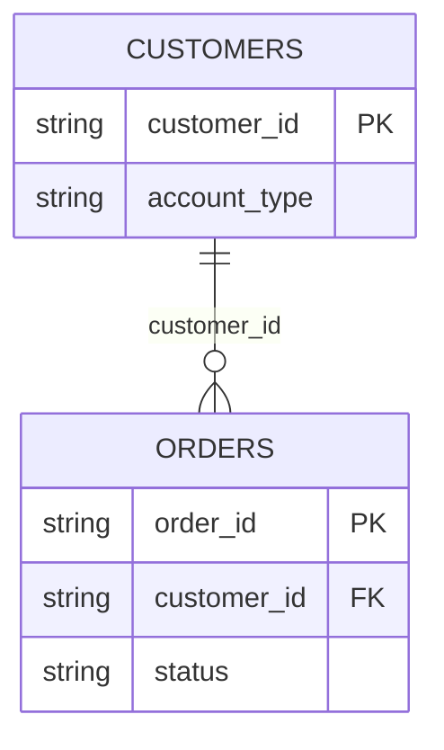

# Schema

| Column | Type | Description |
| --- | --- | --- |
| `customer_id` | STRING | Primary key. |
| `account_type` | STRING | `paid` or `trial`. Trial rows are excluded from [active customer](active-customer.md). |
| `created_at` | TIMESTAMP | Account creation, not first order. |
| `last_paid_order_at` | TIMESTAMP | Null for customers who never paid. Maintained by the nightly job. |

# Joins

# Gotchas

- **`last_paid_order_at` lags by up to 24 hours.** It is maintained by a nightly job, so do not use it for same-day reporting. The sanctioned query in [counting active customers](count-active-customers.md) reads `orders` directly for this reason.
- **The table contains trial accounts.** Counting rows here is not counting customers. See [trial accounts](known-issue-trial-accounts.md).

The business meaning of a row is defined by the [customer status policy](customer-status-policy.md).
