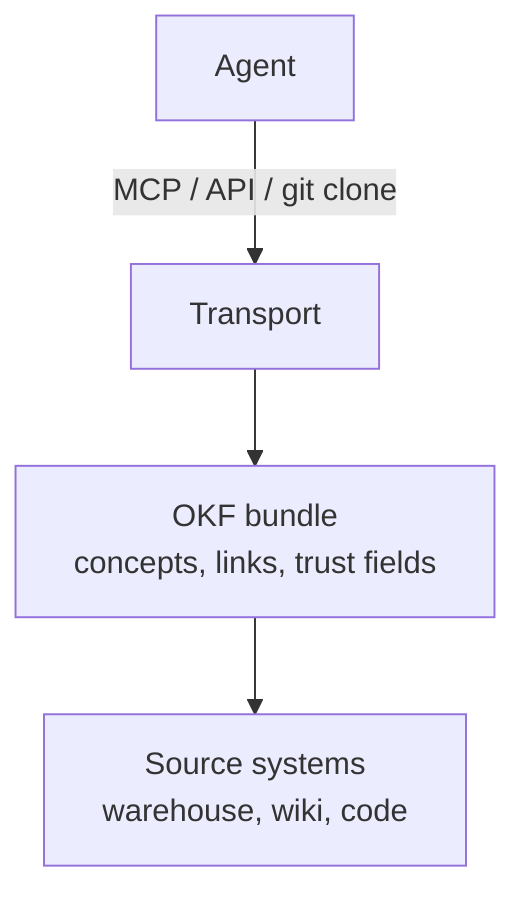

# The two layers

`Protocols (MCP, APIs, tools)`
: How knowledge **travels**. Connect an agent to a system. Standardize the call, the auth, the transport. MCP describes itself as a USB-C port for AI applications, which is exactly right and exactly the limit: a port says nothing about what you send through it.[^mcp]

`Formats (OKF)`
: What knowledge **is**. Standardize the thing that travels, so any producer's knowledge reads in any consumer's agent.

A perfect pipe to an empty reservoir is still a drought.

# Why the layers do not substitute

A protocol makes the transfer uniform and stays silent about the payload. Two teams can both serve knowledge over MCP and still hand an agent two incompatible blobs, one a JSON catalog dump, one a wiki HTML page. The client has to be taught each one, which is the [scattered-knowledge](/context/scattered-knowledge.md) problem restored one layer up.

A format makes the payload uniform and stays silent about the transfer. That is deliberate: OKF explicitly does not prescribe storage, serving, or query infrastructure. See [non-goals](/spec/non-goals.md).

# The stack, in practice

The same bundle can be cloned into a repo, served by an MCP server, or read from disk by a local tool, without changing a byte. That property is what "portable" buys, and it is why [distribution](/practice/distribution.md) is a paragraph rather than a product.

# It also stacks with the web conventions

OKF sits alongside `sitemap.xml` and `llms.txt` rather than competing with them. See [how OKF stacks with llms.txt](/ecosystem/llms-txt-and-sitemap.md).

# Related

- [Tools and MCP](/approaches/tools-and-mcp.md) is the protocol layer in detail.
- [Design principles](/spec/design-principles.md) names this as producer and consumer independence.

[^mcp]: Model Context Protocol.

