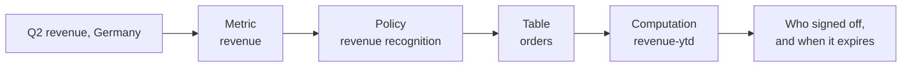

# The four

| # | Failure | What goes wrong | What OKF does instead |
| --- | --- | --- | --- |
| 01 | Shredding | Chunking destroys the structure you spent years building. A schema table arrives as half a table. The caveat lands in a different chunk than the rule it qualifies. | A [concept](/spec/concept-document.md) is the unit, whole |
| 02 | Similar is not right | The deprecated page reads exactly like the current one. Nothing in a similarity score knows which of the two Finance approved. | [`status` and `stale_after`](/trust/lifecycle.md) |
| 03 | No relationships | You get five fragments, never the map between them. | [Cross-links](/spec/cross-linking.md) |
| 04 | No accountability | A chunk carries no author, no review, no expiry. You cannot diff it, review it, or hold anyone to it. | [`generated` and `verified`](/trust/generated-and-verified.md), plus [`sources`](/trust/sources.md) |

Failure 03 is the one that hurts an agent most. Agents work by traversal: this metric, then that policy, then that table, then this join. A flat ranked list has no edges to follow.

None of these are defects in the original method. Lewis et al. proposed retrieval as a way to pair a generator with an editable non-parametric store, and it does that well.[^rag-paper] The four failures are what appears when the store is a pile of arbitrary chunks and the questions need structure.

A fifth effect compounds them. Recall is highest at the start and end of the input and degrades in the middle of a long context, so raising the number of retrieved chunks buries the good one rather than improving the odds.[^lost-in-the-middle] More retrieval is not a fix for worse retrieval.

# The worked example

Ask: *"What was our Q2 revenue in Germany?"*

What retrieval hands over:

- A slide from a 2025 board deck.
- Half a schema table.
- A wiki paragraph about revenue.
- A Slack quote saying "use the new definition".

The agent improvises SQL. The number looks plausible. It is wrong by 4%.

What it actually needed, in order:

A path, not a pile. Retrieval hands you fragments. An agent needs a map.

# Related

- [Retrieval-augmented generation](/approaches/retrieval-augmented-generation.md) is the pipeline these failures come from.
- [OKF versus retrieval](/approaches/okf-versus-retrieval.md) sets the two side by side and says which to use where.
- [Attested computation](/trust/attested-computation.md) closes the last step of the path: proving the number came from the sanctioned query.
- [Running retrieval and OKF together](/approaches/retrieval-and-okf-together.md) turns each failure into a fix you can apply to the stack you already run.

[^rag-paper]: Lewis et al., Retrieval-Augmented Generation for Knowledge-Intensive NLP Tasks (NeurIPS 2020).
[^lost-in-the-middle]: Liu et al., Lost in the Middle: How Language Models Use Long Contexts (2023).

