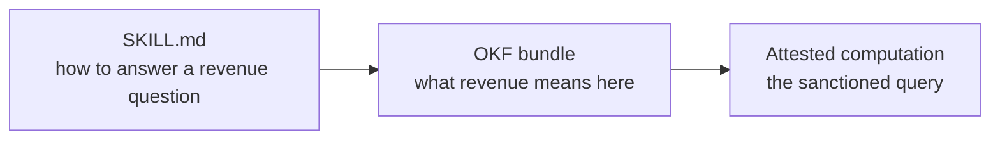

# What it is

A skill is a folder containing a `SKILL.md`: frontmatter with at least a `name` and a `description`, then instructions telling an agent how to perform a task. It may bundle `scripts/`, `references/`, and `assets/` alongside.[^agent-skills]

```
my-skill/
├── SKILL.md          required: metadata + instructions
├── scripts/          optional: executable code
├── references/       optional: documentation
└── assets/           optional: templates, resources
```

The format came out of Anthropic, was released as an open standard, and is now read by a long list of agent products. As with OKF, the portability comes from the format rather than from a runtime.

# The same mechanism, one layer over

Skills load by **progressive disclosure**, in three stages:

1. **Discovery.** At startup the agent loads only each skill's `name` and `description`, enough to know when one might be relevant.
2. **Activation.** When a task matches the description, it reads the full `SKILL.md`.
3. **Execution.** It follows the instructions, loading referenced files or running bundled code only as needed.

That is the same idea as an [`index.md`](/spec/index-file.md) listing: a cheap layer of descriptions so the expensive content stays on disk until something needs it. Both formats are answering the same constraint, [a finite context window](/context/context-window.md). See [progressive disclosure](/practice/progressive-disclosure.md).

# The distinction that matters

`A skill`
: **How to do** something. A procedure, a method, an order of operations. Correct independently of your company.

`A bundle`
: **What is true** about a domain. Facts, definitions, relationships, and who vouches for them. Meaningless outside your context.

The `okf` skill is the worked example. It knows how to write a conformant bundle, how to run the validator, and what bookkeeping an edit implies. It knows nothing about your revenue definition, and it should not. See [the okf skill](/ecosystem/okf-skill.md).

# Where the line gets blurry, honestly

The Agent Skills format describes itself as packaging specialized knowledge *and* workflows, and plenty of skills do carry domain facts. The overlap is real, so the useful question is not "which format" but "which half of the content is this?"

Two failure modes follow from getting it wrong:

- **Facts baked into a skill.** Hardcode the revenue definition in a `SKILL.md` and it rots the moment Finance changes it. The skill carries no [`sources`](/trust/sources.md), no [`verified`](/trust/generated-and-verified.md), no [`stale_after`](/trust/lifecycle.md), so nothing records that it went stale or who last checked it.
- **Procedure scattered across a bundle.** Steps written as concepts read as knowledge and get retrieved out of order. A procedure has a sequence, and a knowledge graph deliberately does not.

# They compose

The clean pattern is a skill that knows the method and points at a bundle for the facts:



A skill can also *author* a bundle, which is what the `okf` skill does, and it can ship a bundle inside its own `references/` directory. Neither format has to know the other exists, because both are folders of markdown in git.

# Related

- [Briefing files](/approaches/briefing-files.md) are the same instinct at repo scope, and stop at one file.
- [Tools and MCP](/approaches/tools-and-mcp.md) give an agent reach, where a skill gives it method.
- [The okf skill](/ecosystem/okf-skill.md) is a skill whose whole subject is producing bundles.

[^agent-skills]: Agent Skills, an open format for extending agent capabilities.
