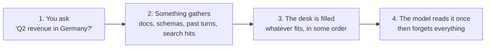

# The four steps of a turn

Step 2 is context assembly. It picks what the model sees, in what order, and at what fidelity. Everything the agent then says is downstream of that choice.

# Why it is the leverage point

The industry keeps upgrading the reader. Bigger windows, better reasoning, faster inference. The bottleneck is the reading material. A stronger model given a half-schema and a deprecated definition produces a more confident wrong answer, not a right one.

Assembly is also the step almost nobody owns. The model is the vendor's, the prompt belongs to the product team, the documents belong to whoever wrote them, and the code that chooses between them is usually a few lines nobody has reviewed since it was written.

Ordering is part of the job, not a detail after it. Recall is highest for material at the start or the end of the input and degrades for material in the middle, so an assembler that appends the most important page into the middle of a long context has hidden it while appearing to supply it.[^lost-in-the-middle] Selecting fewer, better pages beats padding the window.

# What good assembly needs from the knowledge side

Assembly can only be as good as what it selects from. Three properties matter, and each maps to a part of the format:

- **Whole units.** A rule and its caveat must travel together. See [the concept document](/spec/concept-document.md).
- **Edges to follow.** The next thing to load should be derivable from the last thing loaded. See [cross-linking](/spec/cross-linking.md).
- **Signals to filter on.** Assembly should be able to skip a deprecated or unreviewed page before spending tokens on it. See [trust tiers](/trust/trust-tiers.md) and [lifecycle](/trust/lifecycle.md).

[Retrieval](/approaches/retrieval-augmented-generation.md) gives assembly a ranked pile of text fragments and none of the three. That gap is the argument for the format.

# Related

- [The context window](/context/context-window.md) is what assembly fills.
- [Scattered knowledge](/context/scattered-knowledge.md) is what assembly has to work with in most organizations.
- [Consuming a bundle](/practice/consuming-a-bundle.md) is assembly done against an OKF bundle.

[^lost-in-the-middle]: Liu et al., Lost in the Middle: How Language Models Use Long Contexts (2023).

