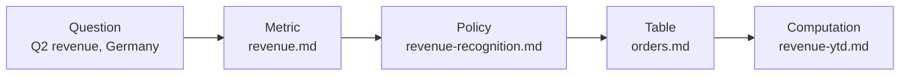

# Two link forms

`Bundle-absolute`
: Begins with `/`, resolved from the bundle root: `/tables/customers.md`. The form the spec **recommends**, because it survives a file moving.

`Relative`
: An ordinary relative path resolved from the linking file's directory: `customers.md`, `../policies/revenue.md`.

Consumer support splits along this line, and a producer should know it before choosing. The spec recommends bundle-absolute. Google's reference visualizer builds no edges from that form, GitHub resolves it against the repository root and serves a 404, and OKF Studio resolves it while advising relative targets for portability.

This bundle wrote bundle-absolute links first, following the spec. Then a person browsed it on GitHub, clicked a link, and hit the 404, and the bundle switched to relative, the same call Google made for its own sample bundles for the same reason. The trade is real: a relative link breaks when the *linking* file moves, an absolute one breaks in the most common place bundles get read. Until renderers catch up with the recommendation, relative is the form that reaches readers, and [open questions](../ecosystem/open-questions.md) tracks the gap, including how a recommendation dies when implementations decline it.

Path-valued frontmatter fields (`sources[].resource`, `computation`, `executor.resource`, `attester.resource`) accept an absolute URL, a bundle-absolute path, or a relative path.[^spec]

# The link is the edge, the prose is the label

A link from A to B asserts a *relationship*. The surrounding prose, not the link, conveys which kind: a foreign key, a derivation, a supersedes, a depends-on.

That is a deliberate simplification. The format defines no typed-edge syntax, requires no ontology, and needs no graph database. The graph is the markdown links you already write. [Knowledge graphs and ontologies](../approaches/knowledge-graphs-and-ontologies.md) works through what that trade gives up, and when a real graph is the better tool.

Write the relationship into the sentence:

```markdown
The tier is derived from [`verified`](../trust/generated-and-verified.md),
never declared, and a consumer keys off the [`human:` prefix](../trust/actor-convention.md)
to classify it.
```

An agent reading that gets both the edge and its meaning in one pass. A bare `See also: /trust/actor-convention.md` gets it the edge and nothing else.

# Why traversal is the point

Agents reason by following a path someone authored on purpose:



Each hop is a decision a person made about what depends on what. That is the thing [retrieval cannot reconstruct](../approaches/retrieval-failure-modes.md) from a ranked list.

# Consumers tolerate broken links

A link whose target does not exist in the bundle is not malformed, and consumers **MUST** tolerate it. That keeps a partial bundle usable while someone writes it.

Tolerated is not the same as good. A producer should still ship a connected graph with no orphans and no broken edges. An agent cannot reach an orphan or cross a broken link. See [graph hygiene](../practice/graph-hygiene.md), which the `--strict` [validator](../practice/validation.md) gates on.

# Related

- [Concept ID](concept-id.md) is what a link resolves to.
- [The index file](index-file.md) is navigation, and is deliberately not a link target for a concept.

[^spec]: OKF v0.2 specification, section 6.
