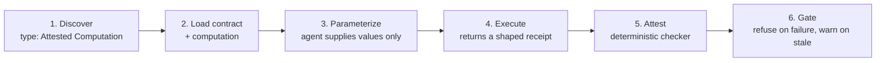

# The question it answers

"Where did that number come from?" An agent that writes plausible SQL produces a plausible number, and nothing in the answer distinguishes it from the right one. An Attested Computation makes the difference checkable.

It is a standalone concept with `type: Attested Computation`. One computation can back a metric, a dashboard concept and a report, so it is written once and referenced from each.

# The contract

```yaml
---
type: Attested Computation
title: Revenue for fiscal year
description: Recognized revenue for a fiscal year, per Finance's definition.
status: stable
runtime: bigquery
parameters:
  - { name: year, type: integer, required: true }
computation: references/computations/lib/revenue.sql
executor:
  resource: references/skills/run-on-bq.md
  receipt: [job_id, executed_sql, result]
attester:
  resource: references/attesters/revenue.py
generated: { by: reference_agent/gemini-2.5-pro, at: 2026-06-20T22:53:05Z }
verified: { by: human:ahormati, at: 2026-06-25T09:00:00Z }
stale_after: 2026-09-23
---
```

`runtime`
: **REQUIRED**. How to run the computation, and therefore how the executor and attester interpret it and what `parameters` mean. Example values: `bigquery`, `postgres`, `dbt`, `python`, `Looker`.

`parameters`
: Typed, named holes, each `{ name, type, required }`. Binding semantics follow the runtime.

`computation`
: Optional path to a file holding the computation, used instead of an inline body fence.

`executor`
: `resource` names run instructions or code. `receipt` declares the fields a run must return: the evidence the attester inspects, for example a BigQuery `job_id`, the executed SQL, and the result.

`attester`
: The deterministic check. `resource` names code, **no LLM**, that takes a receipt and returns a verdict.

# Supplying the computation

Two forms. **Inline**, a single fenced code block in the body under `# Computation`, best for a short computation reviewed alongside its contract. **File-based**, set `computation` to a path and omit the body fence, for a long or generated computation already shared with non-OKF tools.

```sql
SELECT SUM(CASE WHEN o.currency = 'USD'
                THEN o.net_amount
                ELSE o.net_amount * fx.rate_to_usd
           END) AS revenue_usd
FROM  `acme.sales.orders` AS o
LEFT JOIN `acme.finance.fx_daily_rates` AS fx
  ON  fx.currency  = o.currency
  AND fx.rate_date = DATE(o.order_ts)
WHERE o.order_status = 'delivered'
  AND EXTRACT(YEAR FROM o.order_ts) = @year
```

The hard constraint: an agent **MAY** only supply *values* for the declared `parameters`. It **MUST NOT** author or edit the computation. It may set `year`. It may never touch the join, the filter or the table.

# The two checks

`Provenance`
: The computation that ran equals `computation` bound with the claimed parameters, not agent-authored SQL. Compared on canonicalized form, so whitespace and formatting do not matter and a swapped table, an added filter or a dropped join all fail.

`Fidelity`
: The displayed value matches the receipt's authoritative source, re-read by job id rather than taken from the agent's text.

# The consumer workflow



Consumers **SHOULD** surface, not silently drop, a failing attestation. A verdict of false means refuse to display the number.

# What OKF does and does not do here

OKF records the computation and how to check it. It never executes anything itself. The runtime protocol, the receipt and verdict wire formats, the attester ABI, and attestation caching are all [deferred to a later revision](../spec/versioning.md), so treat your executor and attester as local implementations rather than as standard interfaces.

# Related

- [Verification versus attestation](attestation-versus-verification.md) is the distinction people most often collapse.
- [Four ways retrieval lets an agent down](../approaches/retrieval-failure-modes.md) ends at the number this concept protects.

