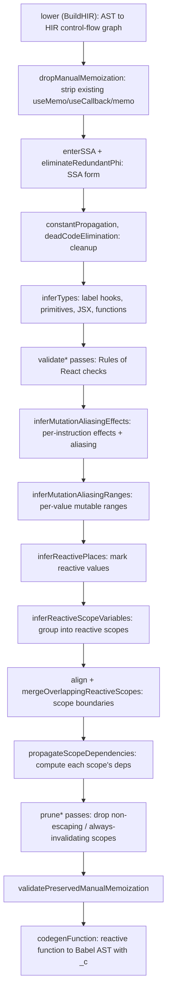

# What it is

React Compiler is an ahead-of-time (AOT) build-time transform. It reads component and hook source that follows the [Rules of React](/reference/rules/components-and-hooks-must-be-pure.md) and rewrites it to memoize automatically, so you drop most manual [`useMemo`](/reference/react/hooks/useMemo.md), [`useCallback`](/reference/react/hooks/useCallback.md), and [`memo`](/reference/react/apis/memo.md). It ships as a Babel plugin (`babel-plugin-react-compiler`) wrapping a core compiler that is decoupled from Babel; the [introduction](introduction.md) covers the user-facing promise, and this concept covers the machinery underneath. The output is plain React: no framework-level runtime, only a small per-component cache (see the [memoization model](memoization-model.md)).

The guiding principle is soundness over coverage. The compiler models your code precisely enough to prove a rewrite preserves behavior, and when it cannot prove that, it leaves the function untouched. This is why "it broke my app" is almost always a Rules of React violation the compiler could not see, not a miscompilation. See [debugging](debugging.md).

# The pipeline

Compilation is a long sequence of passes over an intermediate representation, not a single AST walk. The open-source `Pipeline.ts` runs on the order of 60 passes; most are small validations, assertions, and normalizations, and a handful carry the real analysis. Each pass narrows what the compiler knows about which values change, when they change, and what may mutate them. Passes are named here exactly as they appear in the source, so you can find them.

## Lowering to HIR (`lower` / BuildHIR)

The Babel AST is lowered into a High-level Intermediate Representation: a control-flow graph of basic blocks, where implicit JavaScript control flow (`if`/`else`, loops, `try`/`catch`, `&&`, `||`, `?.`) becomes explicit edges. The representation, its instructions and `Place` metadata, and a worked lowering example are documented in [HIR](glossary/hir.md). Making control flow explicit as a graph is what lets every later pass reason about memoization per expression rather than per component. Early normalization passes (`pruneMaybeThrows`, `inlineImmediatelyInvokedFunctionExpressions`, `mergeConsecutiveBlocks`) simplify the graph before analysis.

## Dropping manual memoization (`dropManualMemoization`)

Before analyzing, the compiler removes your existing `useMemo`, `useCallback`, and `memo` and treats the code as if you had written it plain. It then re-derives memoization from scratch. This is why the compiler's result is independent of, and usually more precise than, your hand-written memoization, and why "leave existing memoization in place, it can change output" is the guidance (see the [introduction](introduction.md)). A later pass, `validatePreservedManualMemoization`, checks that the re-derived memoization is at least as correct as what it replaced; that check is what the [preserve-manual-memoization lint](/reference/eslint-plugin-react-hooks/lints/preserve-manual-memoization.md) surfaces to you early.

## SSA form (`enterSSA`, `eliminateRedundantPhi`)

The HIR is rewritten into Static Single Assignment form so every variable is assigned exactly once and phi nodes merge competing definitions where control-flow paths rejoin. This removes the ambiguity of "which value does this name hold here," a precondition for every dataflow analysis that follows; the [HIR](glossary/hir.md) concept shows the phi-node form on a worked example. `constantPropagation` and `deadCodeElimination` then simplify the graph.

## Type inference (`inferTypes`)

A deliberately conservative pass labels values with the types that matter for later analysis: which calls are hooks, which values are primitives, which are functions, which are JSX. It needs no TypeScript or Flow annotations. Knowing a call is a hook, for instance, tells the compiler it must run every render and cannot be hoisted into or cached inside a memoization scope.

## Validation (the `validate*` passes)

A family of passes checks the code against the Rules of React the compiler can verify statically: `validateHooksUsage` (hooks not called conditionally or in loops), `validateNoRefAccessInRender`, `validateNoSetStateInRender`, `validateNoSetStateInEffects`, `validateStaticComponents`, `validateNoCapitalizedCalls`, `validateNoJSXInTryStatements`, and `validateExhaustiveDependencies`. Each maps to a rule the [ESLint plugin](linting.md) reports earlier, for example `validateNoRefAccessInRender` corresponds to the [refs lint](/reference/eslint-plugin-react-hooks/lints/refs.md). A violation bails the function rather than risking a wrong rewrite.

## Effect, mutability, and aliasing inference (`inferMutationAliasingEffects`, `inferMutationAliasingRanges`)

This is the analytical heart of the compiler and the part that makes memoization sound. `inferMutationAliasingEffects` labels each instruction with an effect (read, store, capture, mutate, freeze), `inferMutationAliasingRanges` collapses those into a mutable range per value, and `inferReactivePlaces` marks which values are reactive. The full model, the effect kinds, aliasing, mutable ranges, and the freeze point, is documented in the [effect and mutability model](glossary/mutability-model.md). The short version: the compiler caches a value only after proving its mutable range has ended, so it never caches something still changing.

## Reactive scope inference and construction (`inferReactiveScopeVariables` and neighbors)

`inferReactiveScopeVariables` groups values that create and mutate together into [reactive scopes](glossary/reactive-scope.md), the compiler's unit of memoization. Values that mutate each other or derive from one another must share a scope so they recompute together and are never left half-stale.

Several passes then shape those scopes. `alignReactiveScopesToBlockScopesHIR` aligns scope boundaries to block structure so a scope never straddles a branch unsafely. `mergeOverlappingReactiveScopesHIR` merges interleaved scopes. `flattenScopesWithHooksOrUseHIR` pulls hook calls out of scopes, since hooks must run every render. `propagateScopeDependenciesHIR` computes each scope's precise **dependency** set from the dataflow, the inputs whose change forces recomputation. `buildReactiveFunction` then converts the HIR into the ReactiveFunction representation codegen consumes.

## Reactive scope optimization (the `prune*` and `merge*` passes)

The compiler now prunes memoization that would not pay off. `pruneNonEscapingScopes` drops scopes whose values never escape the component, so memoizing them buys nothing. `pruneNonReactiveDependencies` and `pruneUnusedScopes` trim the rest. `mergeReactiveScopesThatInvalidateTogether` fuses scopes with identical dependencies so the output allocates fewer cache slots, and `pruneAlwaysInvalidatingScopes` skips memoizing a value that would recompute every render anyway. This stage is where "as precise or more precise than hand-written memoization" is earned, or deliberately given back for safety.

## Code generation (`codegenFunction`)

`validatePreservedManualMemoization` runs first as the final safety gate, then `codegenFunction` lowers the optimized ReactiveFunction back into a Babel AST. Each surviving reactive scope becomes a guarded block: read the cached dependencies and outputs from the per-component cache, compare current dependencies to the cached ones, and either reuse the cached output or recompute and store it. The concrete shape of that generated code, the `_c` cache hook, and the sentinel are covered in the [memoization model](memoization-model.md).

# Why it bails safely

At every validation and inference step, the compiler's fallback is to not compile. If it cannot model a construct soundly (`eval`, `with`, rarely-used syntax the analysis does not cover, or code that violates the rules), it skips that one function and moves on, leaving the rest of the module optimized. Class components are never compiled; they run as historical React. This "skip, don't guess" stance is the reason build-time compiler errors are rare and most real problems show up at runtime as undetected rule violations. The [ESLint rules](linting.md) exist to catch those violations before they reach the compiler.

# Cost model

The transform runs at build time, so there is no per-render analysis cost. Reported overheads are a build-time increase in the tens-of-percent range (incremental builds mostly unaffected) and a low single-digit percent bundle-size increase from the inlined cache helpers. Both are project-specific; measure rather than assume. The runtime cost is one fixed-size cache array per component instance, detailed in the [memoization model](memoization-model.md).

# Related

Term-level detail lives in the glossary concepts:

- [HIR](glossary/hir.md): the representation, its instructions and `Place` metadata, and the worked lowering and SSA examples.
- [Effect and mutability model](glossary/mutability-model.md): the effect kinds, aliasing, mutable ranges, and freeze point behind the soundness argument.
- [Reactive scope](glossary/reactive-scope.md): the unit of memoization, its dependencies, and how scopes map to cache slots.

And the surrounding concepts:

- [The Rust port](rust-port.md): the official Rust reimplementation that keeps this exact pipeline.
- [Memoization model](memoization-model.md): what the pipeline emits and how the runtime cache bails re-renders.
- [Introduction](introduction.md): the user-facing promise this machinery delivers.
- [Debugging](debugging.md): why runtime issues trace back to Rules of React violations the analysis could not see.
- [Rules of React](/reference/rules/components-and-hooks-must-be-pure.md): the contract the whole pipeline assumes.

# Citations

[1] [React Compiler design goals](https://github.com/facebook/react/blob/main/compiler/docs/DESIGN_GOALS.md)
[2] [React Compiler pipeline (Pipeline.ts)](https://github.com/facebook/react/blob/main/compiler/packages/babel-plugin-react-compiler/src/Entrypoint/Pipeline.ts)
[3] [Open-source React Compiler (PR #29061)](https://github.com/facebook/react/pull/29061)
[4] [React Compiler, How Does It Work? [3] - HIR Transformation (Lowering)](https://yongseok.me/blog/en/react_compiler_3/)
[5] [The Mutability and Aliasing Model in React](https://shapkarin.me/articles/drop-react-manual-memoization/)
[6] [Introduction](https://react.dev/learn/react-compiler/introduction)
