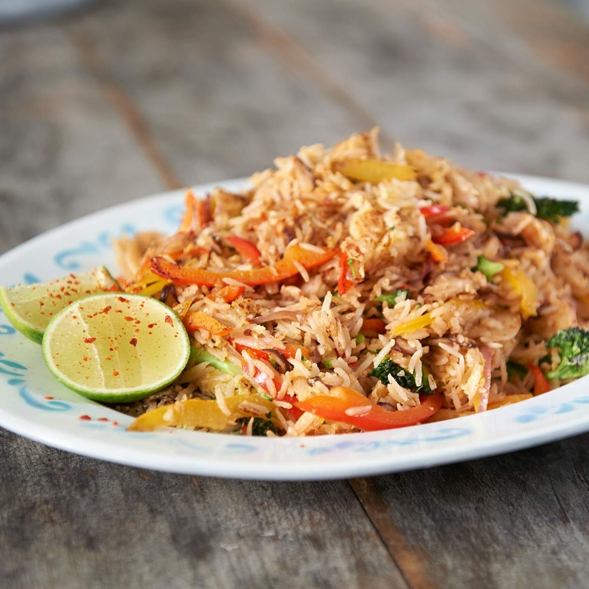

# Was es ist

Das Gericht, das aus dem Rest von gestern entsteht. Gebratener Reis lebt davon, dass der Reis **trocken und kalt** ist: frisch gekochter Reis dampft in der Pfanne, verklebt und wird matschig, weil seine Oberfläche noch Wasser trägt. Ein Tag im Kühlschrank entzieht dieses Wasser und lässt die Stärke zurückkristallisieren, und erst dann springen die Körner einzeln in der Pfanne.

Die Würze steht auf drei Säulen, die man nicht gegeneinander austauschen kann: [helle Sojasauce](/zutaten/wuerzmittel/sojasauce.md) für das Salz, [dunkle Sojasauce](/zutaten/wuerzmittel/dunkle-sojasauce.md) für die Farbe, [geröstetes Sesamöl](/zutaten/grundzutaten/sesamoel.md) für das Aroma, und das Sesamöl kommt erst vom Herd, weil es Hitze nicht verträgt.

# Zutaten

Für 1 Portion.

| Menge | Zutat | Hinweis |
|-------|-------|---------|
| 1 Cup | [Langkornreis](/zutaten/grundzutaten/langkornreis.md) | gekocht, abgekühlt, idealerweise vom Vortag |
| nach Bedarf | [Sonnenblumenöl](/zutaten/grundzutaten/sonnenblumenoel.md) | hoch erhitzbar, geschmacksneutral |
| 1/2 Stück | [Paprika](/zutaten/gemuese/paprika.md) | in Streifen |
| 1/4 Stück | [Zucchini](/zutaten/gemuese/zucchini.md) | in Halbmonden |
| 1/4 Kopf | [Brokkoli](/zutaten/gemuese/brokkoli.md) | in kleine Röschen |
| 1 Zehe | [Knoblauch](/zutaten/gemuese/knoblauch.md) | fein gehackt |
| 2 Stück | [Frühlingszwiebeln](/zutaten/gemuese/fruehlingszwiebel.md) | in Ringen, spät zugeben |
| 2 bis 3 | [Eier](/zutaten/milch-und-ei/ei.md) | |
| nach Bedarf | [helle Sojasauce](/zutaten/wuerzmittel/sojasauce.md) | für das Salz |
| nach Bedarf | [dunkle Sojasauce](/zutaten/wuerzmittel/dunkle-sojasauce.md) | für die Farbe, sparsam |
| 1 TL | [geröstetes Sesamöl](/zutaten/grundzutaten/sesamoel.md) | erst am Ende |
| 1/2 Stück | [Limette](/zutaten/obst/limette.md) | optional zum Abschmecken |

# Zubereitung

## Reis vorbereiten

1. Reis zwei- bis dreimal [waschen](/techniken/reis-waschen.md), um die lose Oberflächenstärke zu entfernen. Er klebt dann weniger.
2. Nach dem Kochen offen abdampfen lassen, damit die Restfeuchte weggeht.
3. Idealerweise abgekühlten, trockenen Reis vom Vortag verwenden. Über Nacht unbedeckt im Kühlschrank ist besser als abgedeckt.

## Braten

1. Etwas Öl in einer Pfanne stark erhitzen und den kalten Reis [anbraten](/techniken/anbraten.md), bis er Farbe bekommt und die Körner einzeln springen. Nicht ständig rühren, sondern liegen lassen und dann wenden.
2. Nebenbei das Gemüse und den Knoblauch schneiden und im [Wok-Stil braten](/techniken/wok-braten.md), also bei hoher Hitze und in Bewegung.
3. Die Frühlingszwiebeln erst spät zugeben, sie sollen grün und aromatisch bleiben.

## Eier hinzufügen

1. Den Reis an den Rand schieben und 2 bis 3 Eier in die freie Fläche schlagen.
2. Die Eier langsam zu [Rührei](/techniken/ruehrei.md) ziehen.
3. Sobald das Rührei fast fertig ist, mit dem Reis vermengen.

## Finalisieren

1. Das gebratene Gemüse unterheben.
2. Helle Sojasauce für die Würze, dunkle Sojasauce für die Farbe zugeben. Am Pfannenrand angießen, nicht auf den Reis, damit sie kurz karamellisiert.
3. Geröstetes Sesamöl vom Herd gezogen zugeben.
4. Optional mit Limettensaft und frischen Kräutern garnieren.

# Kennzeichen des gelungenen Ergebnisses

- Die Körner liegen einzeln, nichts klumpt.
- Der Reis hat an einzelnen Stellen Röstfarbe, ist aber nicht durchgehend braun.
- Das Ei ist in weichen Flocken verteilt, nicht als gummiartige Fladen.

# Varianten

| Variante | Änderung |
|----------|----------|
| Nach Uncle Roger | Kein Gemüse, dafür Schalotte, Chili, weißer Pfeffer und MSG; Schweineschmalz statt Öl |
| Mit Fleisch | Reste von [Hähnchenbrust](/zutaten/fleisch/haehnchenbrust.md) oder Schweinefleisch vor dem Gemüse anbraten |
| Vegan | Eier weglassen, dafür zerbröselten [Tofu](/zutaten/grundzutaten/tofu.md) mit Kurkuma anbraten |
| Schärfer | Frische [Chili](/zutaten/gemuese/chili.md) mit dem Knoblauch zugeben |

# Tipps

- Kein frischer Reis. Wenn es doch sein muss: dünn auf einem Blech ausbreiten, 20 Minuten in den Kühlschrank, dann geht es notdürftig.
- Die Pfanne muss heiß und darf nicht voll sein. Zwei kleine Chargen sind besser als eine große, in der alles dünstet.
- Dunkle Sojasauce ist ein Farbmittel, kein Salzlieferant. Ein halber Teelöffel färbt eine ganze Portion, ein Esslöffel macht sie bitter.

# Verwandtes

Die Küche dahinter: [Chinesische Küche](/kuechen/chinesisch.md). Dieselbe Wok-Logik nutzt [Tofu mit Brokkoli](/gerichte/tofu-brokkoli.md); dieselbe Resteverwertung mit Reis, aber gepresst statt gebraten, sind [Onigiri](/gerichte/onigiri.md).
