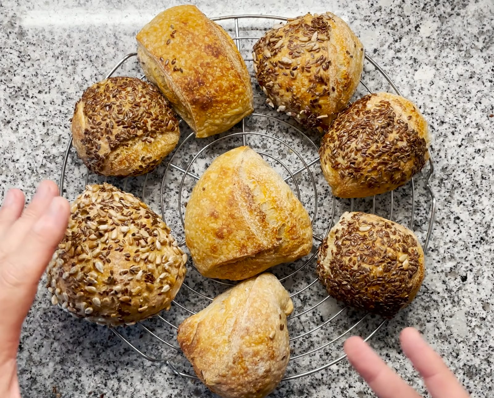
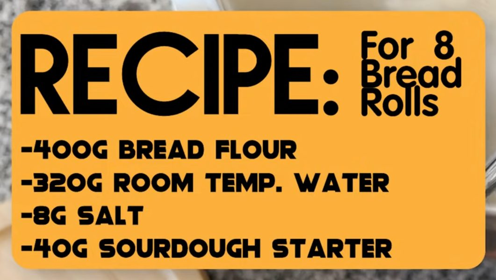

# Was es ist

Brötchen aus vier Zutaten: Mehl, Wasser, Salz, [Sauerteig-Anstellgut](/zutaten/grundzutaten/sauerteig-anstellgut.md). Keine Hefe, kein Fett, kein Zucker. Was das Rezept trägt, ist Zeit statt Zutaten: die lange [kalte Stockgare](/techniken/kalte-stockgare.md) im Kühlschrank baut Geschmack auf und macht den Teig gleichzeitig handhabbar.

Der zweite Teil des Rezepts ist mindestens so nützlich wie der erste: die Brötchen lassen sich **vorbacken und lagern**, also fertig, aber blass backen und Wochen oder Monate später in zehn Minuten aufbacken. Das macht aus einem Backprojekt eine Vorratshaltung.

# Zutaten

Für 8 Brötchen. Bäckerprozente: 80 Prozent Hydration, 2 Prozent Salz, 10 Prozent Anstellgut.

| Menge | Zutat | Hinweis |
|-------|-------|---------|
| 400 g | [Weizenmehl](/zutaten/grundzutaten/weizenmehl.md) | Brotmehl, hoher Proteingehalt (Type 550 oder 812) |
| 320 g | Wasser | Raumtemperatur |
| 8 g | [Salz](/zutaten/gewuerze/salz.md) | |
| 40 g | [Sauerteig-Anstellgut](/zutaten/grundzutaten/sauerteig-anstellgut.md) | aktiv, kurz nach dem Höhepunkt |

# Zubereitung

1. **Teig ansetzen.** Mehl, Wasser, Salz und Anstellgut zu einem normalen Brotteig [verkneten](/techniken/teig-kneten.md), bis er zusammenhängt und sich vom Schüsselrand löst.
2. **Kalt gehen lassen.** Mindestens 12 Stunden in den Kühlschrank. Das ist die [kalte Stockgare](/techniken/kalte-stockgare.md), die Geschmack macht und den Zeitpunkt frei wählbar hält.
3. **Teilen.** Den Teig in 6 bis 8 Brötchen teilen und rund formen.
4. **Ofen vorheizen.** 15 Minuten bei 230 Grad vorheizen. Der Ofen muss durchgeheizt sein, bevor der Teig hineingeht.
5. **Backen.** 20 bis 40 Minuten bei 230 Grad [backen](/techniken/brot-backen.md), je nach gewünschter Bräune und Größe.

# Vorbacken und lagern

Der eigentliche Trick des Rezepts.

1. Nur 20 Minuten bei 230 Grad backen. Das Brötchen ist dann **durchgebacken, aber noch nicht braun**.
2. Vollständig abkühlen lassen.
3. In einer Plastiktüte bei Raumtemperatur bis zu 7 Tage. In einer Plastiktüte im Kühlschrank einige Monate.
4. Zum Verzehr 10 Minuten bei 230 Grad fertig backen. Erst jetzt bekommt es Farbe und Kruste.

# Aufbewahren

Das Vorbackverfahren oben ist der Hauptweg und in dieser Sammlung der eleganteste Fall von [Vorratshaltung](/guide/vorratshaltung.md): gelagert wird ein halbfertiges Produkt, und der letzte Schritt der Zubereitung ist gleichzeitig das Aufwärmen. Daneben gelten für die fertigen Brötchen die üblichen Regeln.

- **Fertig gebacken, Raumtemperatur.** 2 Tage, im Papier- oder Leinenbeutel, nicht in Plastik. Sauerteigbrot hält sich ohne Zusätze länger als Hefebrot, weil die Säure schimmelhemmend wirkt.
- **Fertig gebacken, Kühlschrank.** Nicht empfohlen. Bei Kühlschranktemperatur altbackt Brot am schnellsten, die Stärke retrogradiert dort schneller als bei Raumtemperatur oder im Gefrierfach.
- **Fertig gebacken, Gefrierfach.** 3 Monate. Abgekühlt einzeln [einfrieren](/techniken/einfrieren.md), gefroren 8 bis 10 Minuten bei 200 Grad aufbacken.
- **Vorgebacken.** Siehe oben, das ist der Weg: Plastiktüte bei Raumtemperatur bis zu 7 Tage, im Kühlschrank einige Monate. Hier ist Plastik richtig, weil das blasse Brötchen nicht austrocknen soll.
- **Altbacken.** Kein Verlust. Trockene Brötchen werden zu Croutons, zu Semmelbröseln oder eingeweicht zur Bindung in Hackmassen.

# Kennzeichen des gelungenen Ergebnisses

- Die Kruste knackt hörbar beim Abkühlen.
- Die Krume ist unregelmäßig geöffnet, nicht gleichmäßig feinporig wie Hefegebäck.
- Der Boden klingt hohl, wenn man dagegen klopft.

# Tipps

- Das Anstellgut muss aktiv sein. Wenn es nach dem Füttern nicht mindestens auf das Doppelte geht, geht auch der Teig nicht.
- 80 Prozent Hydration ist ein weicher Teig. Mit nassen Händen arbeiten statt mit Mehl, sonst kommt zu viel zusätzliches Mehl in den Teig.
- Dampf in den ersten 10 Minuten hilft der Ofentriebe. Ein Blech mit heißem Wasser auf dem Ofenboden genügt.

# Verwandtes

Das Brötchen ist die Beilage zu [Pulled Beef](/gerichte/pulled-beef.md): auf den Fotos dieser Notiz stehen beide nebeneinander in der Vorratsdose. Die Techniken dahinter sind [Teig kneten](/techniken/teig-kneten.md), [kalte Stockgare](/techniken/kalte-stockgare.md) und [Brot backen](/techniken/brot-backen.md).
