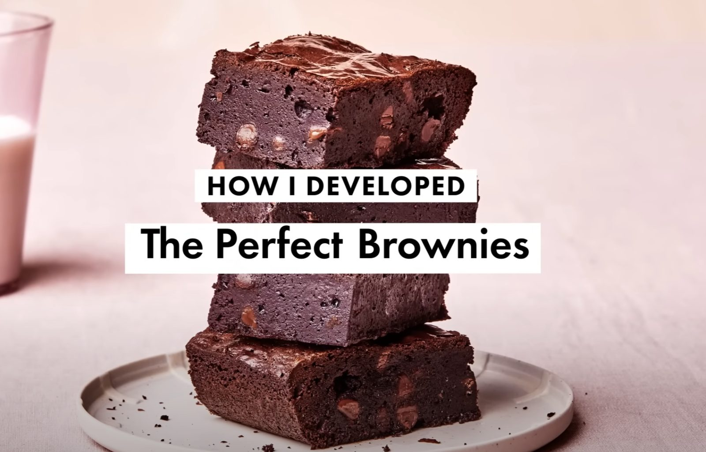

# Was es ist

Der fudgy Typ Brownie, nicht der kuchige. Der Unterschied entsteht nicht am Ofen, sondern im Verhältnis: viel Fett und Schokolade, wenig Mehl, kein Backpulver. Was den Teig trägt, ist das Ei, und was ihm die glänzende, papierdünne Kruste gibt, ist der Zucker, der mit den Eiern lange genug geschlagen wird, um sich zu lösen.

Dreifach Schokolade heißt: geschmolzene [Zartbitterschokolade](/zutaten/suesswaren/zartbitterschokolade.md) im Teig, [Kakaopulver](/zutaten/suesswaren/kakaopulver.md) in den trockenen Zutaten, [Schokoladenchips](/zutaten/suesswaren/schokoladenchips.md) als Stücke. Jede der drei bringt etwas anderes: Schmelz, Tiefe, Biss.

# Zutaten

Für 12 Stück, Form 20x20 cm (8x8 Zoll), Metall.

| Menge | Zutat | Hinweis |
|-------|-------|---------|
| nach Bedarf | [Butter](/zutaten/grundzutaten/butter.md) oder Öl-Spray | zum Fetten der Form |
| 62 g | [Weizenmehl](/zutaten/grundzutaten/weizenmehl.md) | Type 405 / all-purpose |
| 50 g | [Kakaopulver](/zutaten/suesswaren/kakaopulver.md) | Dutch-process, stark entölt |
| 1½ TL | [Salz](/zutaten/gewuerze/salz.md) | Diamond Crystal; bei feinem Salz halbieren |
| 113 g | [Butter](/zutaten/grundzutaten/butter.md) | ungesalzen |
| 113 g | [Zartbitterschokolade](/zutaten/suesswaren/zartbitterschokolade.md) | 70 Prozent, in Stücken |
| 250 g | [Zucker](/zutaten/gewuerze/zucker.md) | |
| 3 große | [Eier](/zutaten/milch-und-ei/ei.md) | |
| 1 EL | [Vanilleextrakt](/zutaten/wuerzmittel/vanilleextrakt.md) | |
| 113 g | [Schokoladenchips](/zutaten/suesswaren/schokoladenchips.md) | halbbitter |

# Zubereitung

1. **Ofen und Form.** Ofen auf 190 Grad (375 Fahrenheit) vorheizen. Die Metallform fetten, mit Backpapier auslegen und an zwei Seiten großzügig überstehen lassen, damit sich der Block später herausheben lässt. Das Papier ebenfalls fetten.
2. **Trockenes mischen.** Mehl, Kakao und Salz in einer kleinen Schüssel verrühren.
3. **Schokolade schmelzen.** Butter und Zartbitterschokolade in einer Metallschüssel über einem Topf mit kaum siedendem Wasser [im Wasserbad schmelzen](/techniken/wasserbad-schmelzen.md), gelegentlich rühren, etwa 5 Minuten. Der Schüsselboden darf das Wasser nicht berühren.
4. **Zucker und Eier.** Den Zucker einrühren, dann die Eier einzeln zugeben und dazwischen jeweils **kräftig** schlagen. Nach dem letzten Ei noch eine Minute weiterschlagen. Dieses Schlagen ist der Schritt, der die glänzende Kruste macht.
5. **Teig fertigstellen.** Schüssel vom Wasserbad nehmen, Vanilleextrakt einrühren, dann die trockenen Zutaten unterrühren. Mit einem Teigschaber die Schokoladenchips unterheben. Teig in die Form streichen und glatt ziehen.
6. **Backen.** 27 bis 30 Minuten backen, bis die Oberfläche fest ist und ein Holzstäbchen aus der Mitte mit wenigen feuchten Krümeln herauskommt. Nicht mit sauberem Stäbchen backen, das wäre bereits zu weit.
7. **Abkühlen.** Mindestens 30 Minuten in der Form abkühlen lassen, besser im Kühlschrank, erst dann in 12 Stücke schneiden. Warm geschnitten zerfallen sie.

# Kennzeichen des gelungenen Ergebnisses

- Die Oberfläche ist glänzend und dünn gecrackt, nicht matt.
- Der Anschnitt ist dicht und feucht, nicht luftig-krümelig.
- Die Ränder sind fest, die Mitte gibt auf Druck leicht nach.

# Aufbewahren

Der hohe Fett- und Zuckeranteil, der die Brownies fudgy macht, macht sie zugleich zum haltbarsten Gebäck dieses Bundles: Zucker bindet Wasser, und Fett schützt vor dem Austrocknen.

- **Raumtemperatur.** 4 Tage, fest in Folie gewickelt oder in einer dichten Dose. Der Standardweg.
- **Kühlschrank.** Nicht empfohlen. Kälte lässt das Fett fest werden, die Brownies werden hart und schmecken flach. Wer sie doch kalt lagert, lässt sie vor dem Essen eine halbe Stunde stehen.
- **Gefrierfach.** 3 Monate. In Stücke schneiden, einzeln in Folie wickeln und [portioniert](/techniken/portionieren.md) [einfrieren](/techniken/einfrieren.md). Ein einzelnes Stück taut in einer halben Stunde bei Raumtemperatur auf, was sie zur besten Vorratsnachspeise dieser Sammlung macht.
- **Aufwärmen.** Nicht nötig. Wer sie warm mag, gibt ein Stück 10 bis 15 Sekunden in die Mikrowelle, dann werden die [Schokoladenchips](/zutaten/suesswaren/schokoladenchips.md) wieder weich.

Anschneiden erst nach dem vollständigen Abkühlen, und für den Vorrat lieber im Stück lassen: eine ganze Platte trocknet langsamer aus als zwölf einzelne Schnittflächen.

# Tipps

- Die Form aus Metall, nicht aus Glas: Glas leitet die Hitze langsamer, die Ränder werden hart, bevor die Mitte fertig ist.
- Kalt schneiden, mit einem heiß abgespülten und abgetrockneten Messer, dann bleiben die Kanten sauber.
- Bis zu 4 Tage vorher backbar. Fest eingewickelt bei Raumtemperatur lagern, nicht im Kühlschrank, sonst werden sie hart.

# Verwandtes

Die Küche dahinter: [US-amerikanische Küche](/kuechen/us-amerikanisch.md). Die Technik des Schmelzens ohne Direkthitze steht in [Wasserbad-Schmelzen](/techniken/wasserbad-schmelzen.md).
