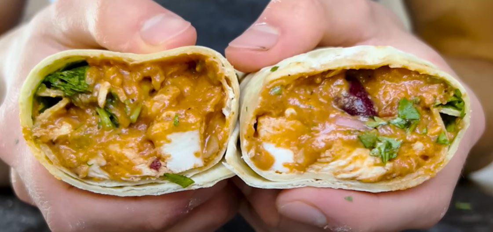

# Was es ist

Ein Vorratsgericht, kein Restaurantburrito. Die Füllung wird einmal gekocht, kalt gestellt, auf sechs große [Weizentortillas](/zutaten/grundzutaten/weizentortilla.md) verteilt und eingefroren. Was danach übrig bleibt, ist eine Mahlzeit, die in zwei Minuten in der Mikrowelle fertig ist.

Zwei Dinge machen den Unterschied zum tiefgekühlten Fertigburrito. Erstens die **Cremigkeit**: neben [Mozzarella](/zutaten/milch-und-ei/mozzarella.md) kommt [Frischkäse](/zutaten/milch-und-ei/frischkaese.md) in die Füllung, der beim Aufwärmen schmilzt statt zu wässern. Zweitens das **Abkühlen vor dem Wickeln**: eine warme Füllung dampft in die Tortilla und weicht sie auf, bevor sie überhaupt im Gefrierfach ist.

# Zutaten

Für 6 große Burritos.

| Menge | Zutat | Hinweis |
|-------|-------|---------|
| 6 große | [Weizentortillas](/zutaten/grundzutaten/weizentortilla.md) | je größer, desto einfacher zu wickeln |
| 700 g | [Hähnchenbrust](/zutaten/fleisch/haehnchenbrust.md) | gegart, gewürfelt (etwa 3 Brüste) |
| 226 g | [Mozzarella](/zutaten/milch-und-ei/mozzarella.md) | gerieben, teilentrahmt |
| 4 Ecken | [Frischkäse](/zutaten/milch-und-ei/frischkaese.md) | Schmelzkäseecken, natur |
| 1 Dose | [Bohnen](/zutaten/grundzutaten/dosenbohnen.md) | Dreierlei-Mischung oder nach Wahl |
| 1 Dose | [passierte Tomaten](/zutaten/wuerzmittel/passierte-tomaten.md) | |
| 1 Stück | [Paprika](/zutaten/gemuese/paprika.md) | gelb, gewürfelt |
| 1 Stück | [Jalapeño](/zutaten/gemuese/chili.md) | gewürfelt |
| 1 Stück | [Limette](/zutaten/obst/limette.md) | oder 1 EL Limettensaft |
| nach Belieben | [Koriandergrün](/zutaten/gemuese/koriandergruen.md) | optional |

## Gewürze

| Menge | Gewürz |
|-------|--------|
| 1 EL | Ancho-Chilipulver |
| 1/2 EL | [Chilipulver](/zutaten/gemuese/chili.md) |
| 1/2 TL | [Paprikapulver](/zutaten/gewuerze/paprikapulver.md), geräuchert |
| 1/2 EL | [Kreuzkümmel](/zutaten/gewuerze/kreuzkuemmel.md) |
| 1/2 TL | [Koriandersamen](/zutaten/gewuerze/koriandersamen.md), gemahlen |
| 2 TL | Zwiebelpulver |
| 1 TL | Knoblauchpulver |
| 1½ TL | [Salz](/zutaten/gewuerze/salz.md) |
| 1 TL | [schwarzer Pfeffer](/zutaten/gewuerze/schwarzer-pfeffer.md) |

Ancho-Chilipulver und Koriandersamen sind laut Quelle verzichtbar, ohne dass das Ergebnis zusammenbricht.

# Zubereitung

1. **Gemüse schneiden.** Paprika und Jalapeño [würfeln](/techniken/wuerfeln.md).
2. **Weich kochen.** Paprika und abgetropfte Bohnen mit einem Schuss Wasser in einer weiten Pfanne weich garen.
3. **Würzen.** Passierte Tomaten und die Gewürzmischung einrühren und kurz durchziehen lassen.
4. **Binden.** Das gegarte, gewürfelte Hähnchen sowie beide Käsesorten unterrühren, bis der Frischkäse geschmolzen ist und die Masse cremig bindet.
5. **Abschmecken.** Limettensaft nach Belieben zugeben.
6. **Abkühlen.** Die Masse 20 Minuten **offen** im Kühlschrank abkühlen lassen. Offen, damit der Dampf entweicht.
7. **Wickeln.** Die Füllung gleichmäßig auf sechs große Tortillas verteilen und einschlagen.
8. **Einfrieren.** Einzeln in Backpapier wickeln und ins Gefrierfach.

# Aufwärmen aus dem Gefrierfach

Die Burritos sind dick. Entweder über Nacht im Kühlschrank auftauen oder in der Mikrowelle antauen, dann pro Seite eine Minute in der Mikrowelle. Wer eine Kruste will, gibt sie danach kurz in eine trockene Pfanne.

# Kennzeichen des gelungenen Ergebnisses

- Die Füllung ist cremig und fällt beim Aufschneiden nicht auseinander.
- Die Tortilla ist nicht durchgeweicht, auch nicht am Boden.
- Nach dem Aufwärmen ist die Mitte heiß, nicht nur der Rand.

# Tipps

- Die Füllung darf nicht zu nass sein. Wenn nach dem Würzen noch Flüssigkeit steht, offen weiter einkochen.
- Backpapier statt Frischhaltefolie: die Folie klebt am gefrorenen Burrito fest.
- Rechnerisch etwa 690 kcal je Burrito bei 55 g Protein, was das Gericht als Meal-Prep-Portion tauglich macht.

# Verwandtes

Die Küche dahinter: [Mexikanische Küche](/kuechen/mexikanisch.md). Dieselbe Vorratslogik, nur beim Brot: [Sauerteigbrötchen](/gerichte/broetchen.md) im Vorbackverfahren.
