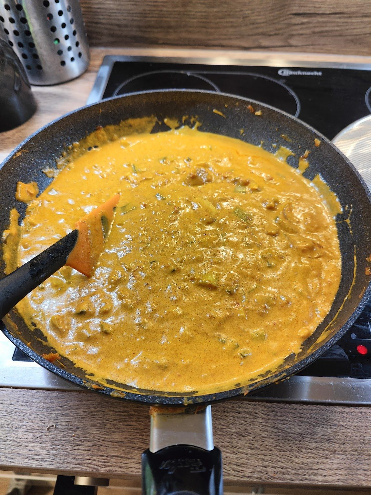
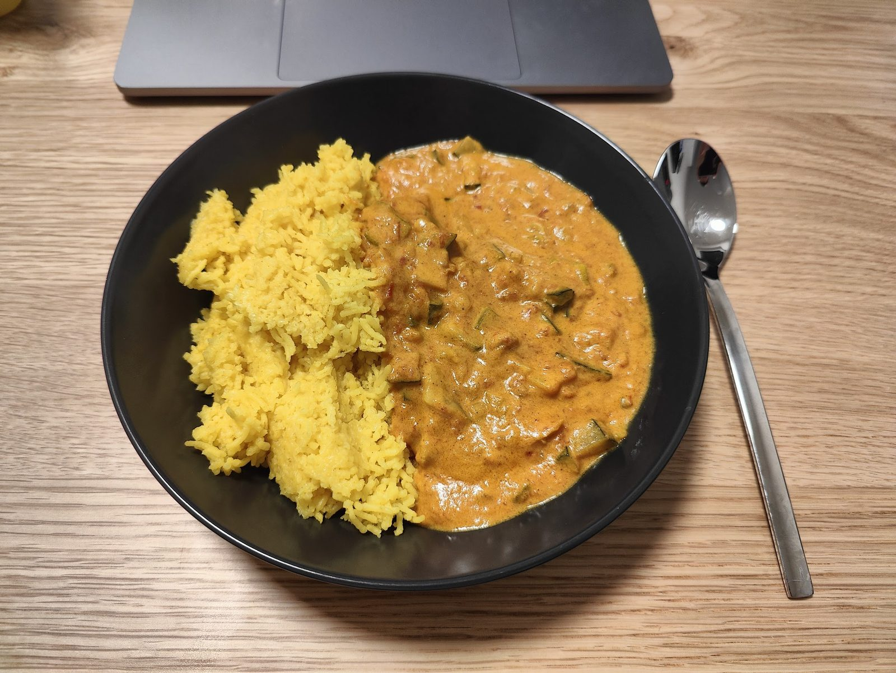

# Was es ist

Ein Curry, dessen Geschmack zu großen Teilen entsteht, bevor der Topf überhaupt auf dem Herd steht. Das Fleisch wird erst [trocken gesalzen](/techniken/trockensalzen.md), also gesalzen und offen im Kühlschrank gelagert, und danach über Nacht in Öl und Kräutern [mariniert](/techniken/marinieren.md). Das Salzen würzt bis in den Kern und hält das Fleisch saftig; die Marinade legt die Aromaschicht darüber.

Die Sauce baut in Stufen auf: [karamellisierte Zwiebeln](/techniken/zwiebeln-karamellisieren.md) als Süße, [Currypaste](/zutaten/wuerzmittel/currypaste.md) im Fett angeröstet, Tomate für Säure, [Kokosmilch](/zutaten/wuerzmittel/kokosmilch.md) für die Bindung. Jede Stufe wird eingekocht, bevor die nächste kommt.

# Zutaten

Für 4 Portionen. Die Notiz nennt keine Mengen; die Angaben hier sind ein Vorschlag für vier Portionen, die Reihenfolge und die Zutaten stammen aus der Notiz.

## Fleisch und Marinade

| Menge | Zutat | Hinweis |
|-------|-------|---------|
| 800 g | [Hähnchenbrust](/zutaten/fleisch/haehnchenbrust.md) oder [Rindfleisch](/zutaten/fleisch/rindfleisch-schmorstueck.md) | in mundgerechte Stücke |
| reichlich | [Salz](/zutaten/gewuerze/salz.md) | zum Trockensalzen |
| 3 EL | Öl | für die Marinade |
| 3 Zehen | [Knoblauch](/zutaten/gemuese/knoblauch.md) | |
| 2 Zweige | [Rosmarin](/zutaten/gewuerze/rosmarin.md) | |
| 2 Zweige | [Thymian](/zutaten/gewuerze/thymian.md) | |
| nach Belieben | [Paprikapulver](/zutaten/gewuerze/paprikapulver.md), [Kreuzkümmel](/zutaten/gewuerze/kreuzkuemmel.md), [Ingwer](/zutaten/gemuese/ingwer.md) | |

## Gemüse und Sauce

| Menge | Zutat | Hinweis |
|-------|-------|---------|
| 2 große | [Zwiebeln](/zutaten/gemuese/zwiebel.md) | in Spalten |
| 1 Bund | [Frühlingszwiebeln](/zutaten/gemuese/fruehlingszwiebel.md) | weißer und grüner Teil getrennt |
| 1 Stück | [Zucchini](/zutaten/gemuese/zucchini.md) | |
| 1 Stück | [Paprika](/zutaten/gemuese/paprika.md) | optional |
| 2 Stück | [Karotten](/zutaten/gemuese/karotte.md) | optional |
| 2 bis 3 EL | [Currypaste](/zutaten/wuerzmittel/currypaste.md) | |
| 400 ml | [passierte Tomaten](/zutaten/wuerzmittel/passierte-tomaten.md) | |
| 400 ml | [Kokosmilch](/zutaten/wuerzmittel/kokosmilch.md) | |
| nach Bedarf | [Kurkuma](/zutaten/gewuerze/kurkuma.md), [Kreuzkümmel](/zutaten/gewuerze/kreuzkuemmel.md), [Ingwer](/zutaten/gemuese/ingwer.md) | zum Nachwürzen |

## Reis

| Menge | Zutat |
|-------|-------|
| 300 g | [Langkornreis](/zutaten/grundzutaten/langkornreis.md) |
| 1 TL | [Salz](/zutaten/gewuerze/salz.md) |
| 2 Stück | [Sternanis](/zutaten/gewuerze/sternanis.md) |
| 2 Stück | [Lorbeerblatt](/zutaten/gewuerze/lorbeerblatt.md) |
| 1/2 TL | [Kurkuma](/zutaten/gewuerze/kurkuma.md) |

# Zubereitung

## Fleisch vorbereiten (am Vortag)

1. Das Fleisch in mundgerechte Stücke schneiden.
2. Auf einen Teller mit Küchenpapier legen und reichlich mit Salz bestreuen. Mindestens eine Stunde in den Kühlschrank.
3. In einen Beutel oder eine Schale mit Deckel geben, zusammen mit Öl, Knoblauch, Rosmarin, Thymian und weiteren Gewürzen nach Belieben (Paprika, Kümmel, Ingwer).
4. Schütteln oder kneten, damit jedes Stück etwas abbekommt.
5. Am besten über Nacht im Kühlschrank [marinieren](/techniken/marinieren.md) lassen.

## Sauce

1. **Zwiebeln karamellisieren.** Zwiebeln mit etwas Öl [karamellisieren](/techniken/zwiebeln-karamellisieren.md), bis sie deutlich braun und süß sind.
2. **Currypaste anrösten.** Currypaste zugeben und vermengen. An dieser Stelle auch die übrigen trockenen Gewürze zugeben, damit sie im Fett aufschließen.
3. **Ablöschen.** Etwas Wasser zugeben und wieder reduzieren lassen.
4. **Fleisch.** Das Fleisch mitsamt dem Saft der Marinade in den Topf geben.
5. **Tomate.** Sobald das Fleisch medium rare ist, die Tomatensauce zugeben und reduzieren lassen (in der Machart eines Chicken Tikka).
6. **Gemüse.** Das Gemüse zugeben und kurz mitkochen.
7. **Kokosmilch.** Kokosmilch zugeben und weiterkochen. Spätestens jetzt den Reis aufsetzen.
8. **Nachwürzen.** Weitere Gewürze nach Bedarf zugeben (Kurkuma, Kreuzkümmel, Ingwer).
9. **Reduzieren.** Deckel ab und die Sauce offen einkochen lassen.
10. **Abschluss.** Zum Schluss den grünen Teil der Frühlingszwiebeln zugeben.

## Reis

Langkornreis mit Salz, Sternanis, Lorbeerblättern und Kurkuma kochen. Die Gewürze kommen ins Kochwasser, nicht an den fertigen Reis.

# Kennzeichen des gelungenen Ergebnisses

- Die Sauce ist samtig und trennt sich nicht in Öl und Wasser.
- Das Fleisch ist bis in die Mitte gewürzt, nicht nur außen.
- Der Reis duftet nach Sternanis, ohne dass man ihn heraussschmeckt.

# Tipps

- Das Trockensalzen am Vortag ist nicht optional, wenn das Ergebnis nach etwas schmecken soll. Eine Stunde ist das Minimum, über Nacht ist besser.
- Currypaste braucht Fett und Hitze. Wer sie erst mit der Flüssigkeit zugibt, verschenkt den größten Teil ihres Aromas.
- Kokosmilch nicht sprudelnd kochen, sie flockt. Kleine Hitze, offener Topf.

# Verwandtes

Die Küche dahinter: [Indische Küche](/kuechen/indisch.md). Der Gegenentwurf aus derselben Currylinie ist das [japanische Curry](/gerichte/japanisches-curry.md), das statt Kokosmilch eine [Mehlschwitze](/techniken/mehlschwitze.md) zum Binden nutzt und die Schärfe zurücknimmt.
