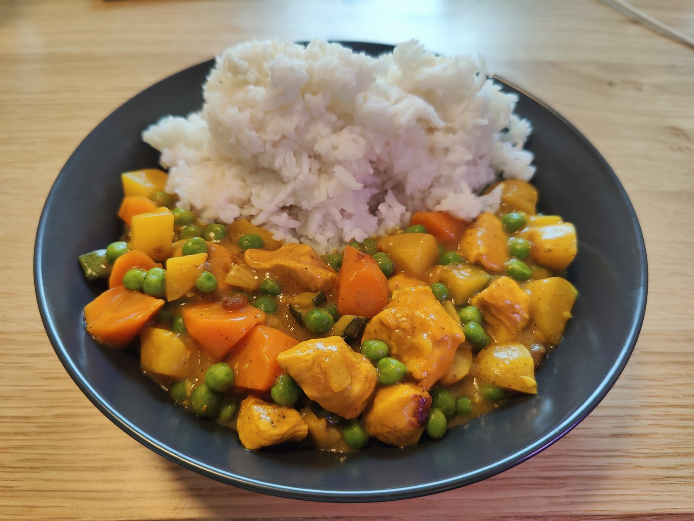

# Was es ist

Dieselbe Gerichtsfamilie wie das [japanische Curry](/gerichte/japanisches-curry.md) mit selbst gemachtem [Curry-Roux](/komponenten/curry-roux.md), aber ein anderer Bauplan. Statt den Roux getrennt in der Pfanne anzusetzen und am Ende einzurühren, werden hier **Currypulver und Mehl direkt im Topf** über dem angebratenen Fleisch geröstet und dann mit Brühe abgelöscht. Das spart einen Topf und etwa 30 Minuten, kostet aber die Kontrolle über die Röstung des Roux.

Zwei Zutaten prägen den Geschmack, die im Grundrezept fehlen: [Rosinen](/zutaten/obst/rosine.md) und [Honig](/zutaten/wuerzmittel/honig.md). Sie ersetzen die Süße, die dort aus 15 Minuten [karamellisierten Zwiebeln](/techniken/zwiebeln-karamellisieren.md) kommt. Deshalb ist diese Version schneller: die Süße wird zugegeben statt erkocht.

# Zutaten

Für 4 Portionen.

| Menge | Zutat | Hinweis |
|-------|-------|---------|
| 4 EL | [Butter](/zutaten/grundzutaten/butter.md), geklärt, oder Öl | |
| 450 g | [Hähnchenbrust](/zutaten/fleisch/haehnchenbrust.md) | in Stücke von etwa 4 cm |
| 1/2 große | [Zwiebel](/zutaten/gemuese/zwiebel.md) | in Scheiben von etwa 1 cm |
| nach Bedarf | [Salz](/zutaten/gewuerze/salz.md), [weißer](/zutaten/gewuerze/weisser-pfeffer.md) oder [schwarzer Pfeffer](/zutaten/gewuerze/schwarzer-pfeffer.md) | frisch gemahlen |
| 3 bis 4 Zehen | [Knoblauch](/zutaten/gemuese/knoblauch.md) | fein gehackt |
| 1 Daumen | [Ingwer](/zutaten/gemuese/ingwer.md) | fein gehackt |
| 2 bis 3 EL | [japanisches Currypulver](/zutaten/gewuerze/currypulver.md) | zum Beispiel S&B |
| 4 EL | [Weizenmehl](/zutaten/grundzutaten/weizenmehl.md) | |
| 1 l | [Hühnerbrühe](/zutaten/grundzutaten/huehnerbruehe.md) | oder Wasser |
| 1 große | [Kartoffel](/zutaten/gemuese/kartoffel.md) | geschält, in Stücke von etwa 4 cm |
| 1 große | [Karotte](/zutaten/gemuese/karotte.md) | geschält, in Stücke von etwa 4 cm |
| 1 EL | [Honig](/zutaten/wuerzmittel/honig.md) | |
| 120 g | [Rosinen](/zutaten/obst/rosine.md) | hell oder normal |
| 150 g | [Erbsen](/zutaten/gemuese/erbse.md) | tiefgekühlt |

Dazu: gedämpfter [japanischer Kurzkornreis](/komponenten/japanischer-reis.md), dünn geschnittener [Schnittlauch](/zutaten/gemuese/knoblauchschnittlauch.md) oder [Frühlingszwiebeln](/zutaten/gemuese/fruehlingszwiebel.md), japanisches Eingelegtes.

# Zubereitung

1. **Fleisch anbraten.** Die Butter bei starker Hitze erhitzen, bis sie leicht raucht. Hitze auf mittelstark reduzieren. Das Hähnchen zugeben und unter gelegentlichem Rühren etwa 3 Minuten [anbraten](/techniken/anbraten.md), bis es leicht Farbe hat. Zwiebeln zugeben, salzen und pfeffern und weitere 3 Minuten braten, bis die Zwiebeln weich sind.
2. **Aromaten und Curry.** Knoblauch und Ingwer zugeben und etwa 30 Sekunden braten, bis es duftet. Currypulver zugeben und etwa 30 Sekunden mitrösten, bis es leicht geröstet ist.
3. **Binden.** Das Mehl zugeben und etwa 30 Sekunden rühren, bis keine trockenen Mehlnester mehr zu sehen sind. Die Brühe angießen und rühren, bis sich das Mehl gelöst hat. Kartoffeln, Karotten, Honig und Rosinen zugeben. Aufkochen, dann auf kaum merkliches [Köcheln](/techniken/koecheln.md) reduzieren. Zugedeckt etwa 10 Minuten garen, bis Kartoffeln und Karotten weich, aber nicht zerfallen sind.
4. **Abschmecken.** Mit Salz, Pfeffer und bei Bedarf mehr Honig abschmecken. Die Erbsen unterrühren.
5. **Anrichten.** Mit gedämpftem weißem Reis servieren, dazu fein geschnittener Schnittlauch oder Frühlingszwiebeln und japanisches Eingelegtes.

# Unterschied zum Grundrezept

| | [Mit Curry-Roux](/gerichte/japanisches-curry.md) | Diese Version |
|--|--|--|
| Bindung | Getrennt angesetzte [Mehlschwitze](/techniken/mehlschwitze.md), am Ende eingerührt | Mehl direkt im Topf über dem Fleisch |
| Süße | 12 bis 15 Minuten karamellisierte Zwiebeln, geriebener Apfel | Rosinen und Honig |
| Zeit | Etwa 80 Minuten | Etwa 40 Minuten |
| Fleisch | [Hähnchenschenkel](/zutaten/fleisch/haehnchenschenkel.md) | [Hähnchenbrust](/zutaten/fleisch/haehnchenbrust.md) |
| Kontrolle | Röstgrad des Roux frei wählbar | Roux röstet nur so lange, wie das Fleisch es zulässt |

Beide sind richtig. Diese Version ist die für einen Werktagabend, die andere die für einen Sonntag.

# Aufbewahren

Die Ein-Topf-Fassung lagert sich noch etwas besser als das [Grundrezept](/gerichte/japanisches-curry.md), weil hier keine großen Kartoffelstücke in der Sauce liegen, die beim Auftauen mehlig würden.

- **Kühlschrank.** [Abgekühlt](/techniken/abkuehlen.md) und [portioniert](/techniken/portionieren.md) 3 bis 4 Tage, Sauce und [Reis](/komponenten/japanischer-reis.md) getrennt.
- **Gefrierfach.** 3 Monate. Die [Erbsen](/zutaten/gemuese/erbse.md) überstehen das problemlos, sie kamen ohnehin aus dem Tiefkühler.
- **Aufwärmen.** Topf, mittlere Hitze, ein Schuss Wasser gegen die nachgedickte Bindung. Siehe [Auftauen und Aufwärmen](/techniken/auftauen-und-aufwaermen.md).

Genau wie beim Grundrezept gilt: einen Tag später ist es besser. Das Rezept ist damit ein guter Kandidat, um sonntags die doppelte Menge zu kochen.

# Tipps

- Das Mehl braucht die 30 Sekunden. Wer sofort ablöscht, schmeckt das rohe Mehl später in der Sauce.
- Die Rosinen zerfallen beim Köcheln teilweise und süßen dabei die Sauce. Wer sie als Stücke will, gibt die Hälfte erst am Schluss zu.
- Erbsen kommen ans Ende und werden nicht mitgekocht, sonst verlieren sie Farbe und Biss.

# Verwandtes

Die Küche dahinter: [Japanische Küche](/kuechen/japanisch.md), Abteilung Yōshoku. Der Reis dazu: [Japanischer Reis](/komponenten/japanischer-reis.md). Der ausführliche Gegenentwurf: [Japanisches Curry](/gerichte/japanisches-curry.md).
