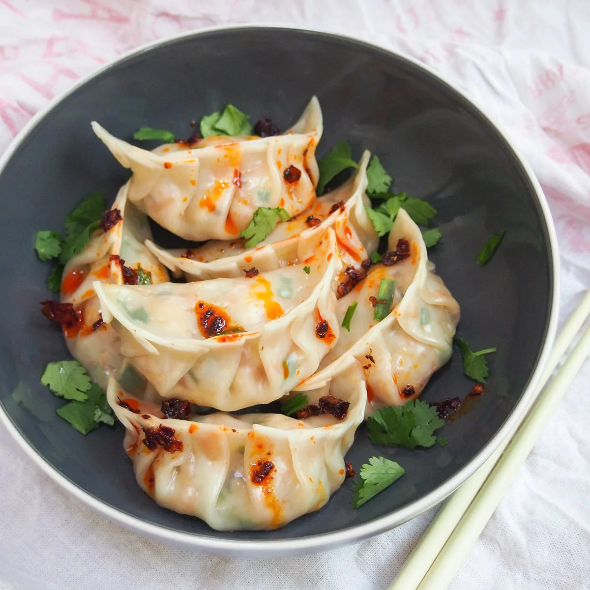

# Was es ist

Die Hausmannskost-Teigtasche Chinas: [Brühteig](/komponenten/jiaozi-teig.md) außen, [Füllung aus Schweinehack und Chinakohl](/komponenten/jiaozi-fuellung.md) innen. In fast jedem chinesischen Haushalt liegt ein Vorrat davon im Gefrierfach, und genau darin liegt der Sinn: Jiaozi sind ein Vorratsgericht, das sich in Gesellschaft schneller macht als allein.

Der Unterschied zwischen den chinesischen Jiaozi und den japanischen Gyoza liegt weniger im Teig als in der Füllung und im Garen. Jiaozi werden meist gekocht und mit gröberer, gemischter Füllung gefüllt; Gyoza haben dünnere Wände, fast immer Schweinehack und werden gebraten und gedämpft.

# Die zwei Bausteine

| Baustein | Konzept |
|----------|---------|
| Teig | [Jiaozi-Teig](/komponenten/jiaozi-teig.md), Mehl und kochendes Wasser |
| Füllung | [Jiaozi-Füllung](/komponenten/jiaozi-fuellung.md), Schweinehack, Chinakohl, Aromaten |

Beide sind eigene Konzepte, weil beide getrennt verwendbar sind: die Füllung geht auch in Wan Tan oder als Hackbällchen, der Teig auch für andere Teigtaschen.

# Zubereitung

1. **Teig ansetzen und ruhen lassen.** Nach [Jiaozi-Teig](/komponenten/jiaozi-teig.md): 3 Cups Mehl mit 1 bis 1½ Cups kochendem Wasser 10 Minuten kneten, in bemehlte Folie wickeln, mindestens 30 Minuten ruhen lassen.
2. **Füllung machen und kalt stellen.** Nach [Jiaozi-Füllung](/komponenten/jiaozi-fuellung.md): Kohl blanchieren und ausdrücken, Fleisch mit den Aromaten 10 Minuten schlagen, Kohl und Schnittlauch unterheben, 30 Minuten kalt stellen.
3. **Ausrollen.** Den Teig zu einer Rolle von etwa 2 cm Durchmesser formen, in Stücke von 1 cm schneiden und zu Kreisen von etwa 7 cm ausrollen. Die Mitte darf dicker bleiben als der Rand.
4. **Füllen und falten.** Je 2 TL Füllung auf einen Kreis geben und nach Wunsch [falten](/techniken/teigtaschen-falten.md). Die Falten sind Zierde, dicht muss nur der Verschluss sein.
5. **Kochen.** Die Teigtaschen in kochendes Wasser geben. Jedes Mal, wenn das Wasser wieder kocht, etwa eine halbe Tasse kaltes Wasser zugeben, um die Temperatur zu senken. Wenn die Teigtaschen an der Oberfläche schwimmen, noch eine Minute garen und herausnehmen.

## Als Gyoza braten

In eine Pfanne mit etwas Öl setzen, bis der Boden goldbraun ist [anbraten](/techniken/anbraten.md), dann einen Schuss Wasser angießen, Deckel drauf und 5 bis 6 Minuten dämpfen, bis das Wasser weg ist. Deckel ab, noch einmal knusprig werden lassen.

# Kennzeichen des gelungenen Ergebnisses

- Der Teig ist zart, aber nirgends durchgeweicht oder aufgeplatzt.
- Die Füllung ist saftig und federt beim Biss, sie ist nicht krümelig.
- Beim Gyoza löst sich der Boden als eine zusammenhängende, goldene Fläche aus der Pfanne.

# Aufbewahren

Die Vorratsform der Jiaozi ist die **rohe** Teigtasche, nicht die gekochte. Genau deshalb lohnt sich der Aufwand von 50 Stück auf einmal: gegessen werden zwölf, die anderen liegen im Gefrierfach.

- **Roh, Gefrierfach.** 3 Monate. Auf einem bemehlten Blech einzeln [vorfrieren](/techniken/einfrieren.md), dann in einen Beutel umfüllen. Gefroren direkt ins kochende Wasser, ohne Auftauen, mit ein bis zwei Minuten mehr Garzeit. Aufgetaute rohe Teigtaschen kleben zusammen und reißen, das Auftauen ist hier also nicht die schonendere, sondern die schlechtere Variante.
- **Roh, Kühlschrank.** 1 Tag, mit Abstand auf einem bemehlten Blech, abgedeckt. Länger nicht: die Füllung zieht Wasser in den Teig, und der Boden weicht durch.
- **Gekocht, Kühlschrank.** 2 Tage. Am besten am nächsten Tag als Gyoza [anbraten](/techniken/anbraten.md), dann ist der weiche Teig wieder knusprig. In der Mikrowelle werden sie zäh.
- **Gekocht, Gefrierfach.** Möglich, aber ohne Gewinn. Wer einfriert, friert roh ein.

Die [Füllung](/komponenten/jiaozi-fuellung.md) allein einzufrieren funktioniert schlechter als die fertige Teigtasche, weil sie nach dem Auftauen Wasser abgibt und dann die Naht sprengt.

# Tipps

- Der Kohl muss wirklich ausgedrückt werden. Restwasser sprengt die Teigtasche beim Garen von innen.
- Zehn Minuten Schlagen der Fleischmasse sind kein Übermaß: erst dadurch wird sie springend statt krümelig.
- Die Zugabe von kaltem Wasser beim Kochen ist nicht Folklore. Sie hält das Wasser knapp unter dem sprudelnden Kochen, bei dem der Teig aufreißt.

# Verwandtes

Die Küche dahinter: [Chinesische Küche](/kuechen/chinesisch.md). Die beiden Bausteine: [Jiaozi-Teig](/komponenten/jiaozi-teig.md) und [Jiaozi-Füllung](/komponenten/jiaozi-fuellung.md). Die Falttechnik steht in [Teigtaschen falten](/techniken/teigtaschen-falten.md).
