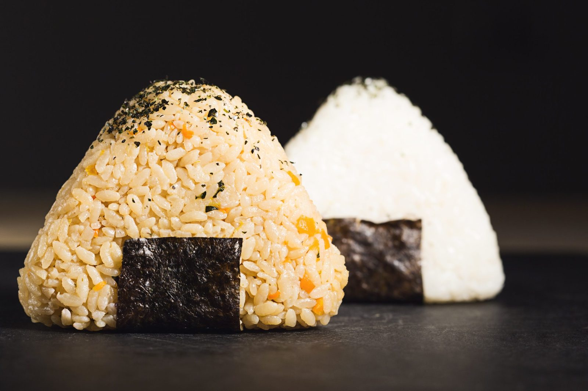

# Was es ist

Ein Reisbällchen, das seinen Zusammenhalt allein aus der Stärke des [japanischen Kurzkornreises](/zutaten/grundzutaten/japanischer-kurzkornreis.md) bezieht. Kein Bindemittel, kein Druck von Werkzeugen: die Hand formt, und der Reis hält, weil er klebrig genug ist.

Der eigentliche Inhalt dieses Rezepts ist der Reis. Wer den [Sushi-Reis](/komponenten/sushi-reis.md) beherrscht, hat Onigiri, Maki und Reisschalen gleichermaßen. Der Rest ist Formsache: befeuchtete Fingerspitzen, drei Handgriffe, fertig.

# Zutaten

Für 4 bis 5 Onigiri.

| Menge | Zutat | Hinweis |
|-------|-------|---------|
| 200 g | [japanischer Kurzkornreis](/zutaten/grundzutaten/japanischer-kurzkornreis.md) | |
| 240 ml | Wasser | zum Kochen |
| etwa 50 ml | Reisessigmischung | siehe [Sushi-Reis](/komponenten/sushi-reis.md) |
| nach Belieben | [Noriblatt](/zutaten/grundzutaten/noriblatt.md) | in Streifen |
| nach Belieben | [Salz](/zutaten/gewuerze/salz.md) | für die Hände |

Die Würzmischung: billiger [Reisessig](/zutaten/wuerzmittel/reisessig.md), 20 g [Zucker](/zutaten/gewuerze/zucker.md), 8 g [Salz](/zutaten/gewuerze/salz.md), leicht erwärmt, bis sich Zucker und Salz gelöst haben.

# Zubereitung

## Reis

Ausführlich in [Sushi-Reis](/komponenten/sushi-reis.md); hier der Ablauf in Kurzform.

1. Den Reis 4 bis 5 Mal gründlich [waschen](/techniken/reis-waschen.md).
2. Etwa 30 Minuten in kaltem Wasser quellen lassen. Er nimmt dabei etwa 80 ml Wasser auf.
3. Mit dem Wasser auf höchster Hitze [kochen](/techniken/reis-kochen-absorptionsmethode.md), bis die ersten Blasen aufsteigen (bei dieser Menge nach etwa 2 Minuten).
4. Auf die niedrigste Stufe stellen und weitere 13 Minuten köcheln lassen. Danach sollte kein Wasser mehr sichtbar sein.
5. Ein sauberes Handtuch auf den Topf legen, mit dem Deckel abdecken und 15 Minuten ohne weitere Wärmezufuhr ziehen lassen.
6. Den Reis vorsichtig lockern und mit etwa 50 ml Reisessigmischung würzen. Die Mischung vorsichtig unterheben, nicht kräftig rühren oder matschen.
7. Warten, bis der Reis mindestens Raumtemperatur erreicht hat. Im Winter geht das besonders gut.

## Formen

1. Die Fingerspitzen befeuchten, damit der Reis nicht kleben bleibt. Wer will, verreibt zusätzlich etwas Salz auf den Händen: das würzt die Außenseite und konserviert leicht.
2. Eine Handvoll Reis nehmen, in der hohlen Hand sammeln und mit der anderen Hand in drei bis vier Bewegungen zum Dreieck drücken. Fest genug, dass es hält, locker genug, dass es im Mund noch als Reis zerfällt.
3. Nach Belieben mit einem Streifen [Nori](/zutaten/grundzutaten/noriblatt.md) umwickeln, direkt vor dem Essen, sonst weicht er durch.

# Kennzeichen des gelungenen Ergebnisses

- Das Onigiri hält in der Hand, zerfällt aber beim Abbeißen in einzelne Körner.
- Die Würzung ist leicht süß-säuerlich, das Salz steht im Hintergrund.
- Der Reis glänzt, die Körner sind ganz und nicht zerdrückt.

# Tipps

- Warmer Reis lässt sich formen, kalter aus dem Kühlschrank nicht mehr. Also abkühlen bis Raumtemperatur, aber nicht kalt stellen.
- Der Reis darf beim Würzen nicht gerührt werden. Mit einem Reisspatel schneidend unterheben, sonst wird die Stärke freigesetzt und der Reis pampig.
- Füllungen (eingelegte Pflaume, gegrillter Lachs, Thunfisch mit Mayonnaise) kommen als kleiner Klumpen in die Mitte, bevor der Reis um sie herum geschlossen wird.

# Verwandtes

Die Küche dahinter: [Japanische Küche](/kuechen/japanisch.md). Der Baustein: [Sushi-Reis](/komponenten/sushi-reis.md). Die ungewürzte Variante desselben Reises steht in [Japanischer Reis](/komponenten/japanischer-reis.md).
