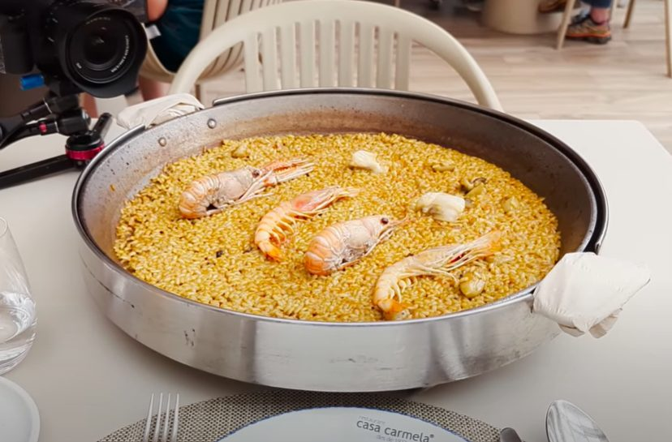

# Was es ist

Ein Reisgericht, dessen Qualität an einem einzigen Merkmal gemessen wird: dem [Socarrat](/techniken/socarrat.md), der karamellisierten Kruste am Pfannenboden. Alles andere im Rezept dient diesem Ziel, auch die Reissorte.

[Bomba-Reis](/zutaten/grundzutaten/bomba-reis.md) ist der Schlüssel. Er nimmt etwa das Dreifache seines Volumens an Flüssigkeit auf, ohne die Kornform zu verlieren, und er darf **nicht gerührt werden**. Wer Paella wie Risotto behandelt, bekommt Risotto: cremig, gebunden, ohne Kruste. Paella soll trockene, einzelne Körner haben und unten eine Kruste.

# Zutaten

Für 4 Portionen. Die Notiz nennt die Kernzutaten und die Zeiten; Mengen sind ein Vorschlag.

| Menge | Zutat | Hinweis |
|-------|-------|---------|
| 320 g | [Bomba-Reis](/zutaten/grundzutaten/bomba-reis.md) | ersatzweise Calasparra, nicht Risottoreis |
| 1 l | Fischfond | heiß, kräftig gewürzt |
| 1 Prise | [Safran](/zutaten/gewuerze/safran.md) | in etwas heißem Fond eingeweicht |
| 2 Stück | [Tomaten](/zutaten/gemuese/tomate.md) | gerieben, ohne Haut |
| 3 Zehen | [Knoblauch](/zutaten/gemuese/knoblauch.md) | fein gehackt |
| 4 EL | Olivenöl | |
| nach Bedarf | [Salz](/zutaten/gewuerze/salz.md), [Paprikapulver](/zutaten/gewuerze/paprikapulver.md) | |

Einlagen nach Region und Vorrat: [Garnelen](/zutaten/fisch/garnele.md), Muscheln, Huhn, Kaninchen, grüne Bohnen. Die Notiz legt sich nicht fest.

# Zubereitung

Der Ablauf ist ein Timing-Rezept, nicht ein Zutatenrezept. Die drei Zeitfenster stammen direkt aus der Notiz.

1. **Sofrito.** Knoblauch in Olivenöl [anschwitzen](/techniken/anschwitzen.md), geriebene Tomate zugeben und einkochen, bis die Masse dunkel und marmeladig ist. Paprikapulver kurz mitrösten, ohne es zu verbrennen.
2. **Reis anrösten.** Den Reis zugeben und kurz im Fett wenden, bis die Körner glasig sind.
3. **Fond angießen.** Heißen Fond mit dem eingeweichten Safran angießen und einmal gleichmäßig verteilen. **Ab hier nicht mehr rühren.**
4. **10 Minuten stark kochen.** Bei hoher Hitze sprudelnd kochen lassen.
5. **10 Minuten sanft köcheln.** Hitze auf mittel bis niedrig senken und weiterkochen, bis die Flüssigkeit fast vollständig aufgenommen ist.
6. **30 bis 60 Sekunden hohe Hitze.** Zum Schluss noch einmal hoch aufdrehen, um den [Socarrat](/techniken/socarrat.md) zu erzeugen. Man hört ihn: das Geräusch wechselt von Blubbern zu Knistern.
7. **Ruhen.** Vom Herd nehmen, mit einem Tuch abdecken und 5 Minuten ruhen lassen.

# Kennzeichen des gelungenen Ergebnisses

- Am Boden löst sich eine goldbraune, zusammenhängende Kruste, die knirscht.
- Die Reisschicht ist flach, höchstens zwei Finger hoch, und die Körner liegen einzeln.
- Die Farbe kommt vom Safran und der Tomate, nicht von Lebensmittelfarbe.

# Aufbewahren

Das Gericht dieses Bundles, das sich am schlechtesten lagern lässt, und zwar aus einem inhaltlichen Grund: der [Socarrat](/techniken/socarrat.md) ist das Qualitätsmaß der Paella, und er entsteht in den letzten 30 bis 60 Sekunden genau einmal. Aufgewärmt gibt es ihn nicht wieder. Eine Paella wird für den Tag gekocht, an dem sie auf dem Tisch steht.

- **Kühlschrank.** 2 Tage, mit ehrlichem Verlust. Der [Bomba-Reis](/zutaten/grundzutaten/bomba-reis.md) hat viel Flüssigkeit aufgenommen und wird beim Stehen weicher.
- **Gefrierfach.** Nicht empfohlen. Der gegarte Reis wird beim Auftauen matschig, und die [Garnelen](/zutaten/fisch/garnele.md) werden zäh.
- **Aufwärmen.** Wenn schon, dann in der Pfanne mit einem Schuss Brühe und Deckel, danach kurz ohne Deckel bei hoher Hitze. Das ergibt kein Socarrat, aber wenigstens wieder eine trockene Oberfläche. Die Mikrowelle macht den Reis pappig.

Die richtige Vorratsarbeit liegt bei diesem Gericht **davor**, nicht danach: der Fond lässt sich Tage vorher ansetzen und [einfrieren](/techniken/einfrieren.md), und mit fertigem Fond ist die Paella selbst in 45 Minuten gekocht.

# Tipps

- Die Pfanne muss weit sein. Paella gart in einer dünnen Schicht; in einem hohen Topf entsteht Reiseintopf.
- Der Fond muss heiß angegossen werden, sonst bricht die Temperatur ein und der Reis gart ungleichmäßig.
- Nicht rühren heißt nicht rühren. Auch nicht einmal kurz.

# Verwandtes

Die Küche dahinter: [Spanische Küche](/kuechen/spanisch.md). Die entscheidende Technik: [Socarrat](/techniken/socarrat.md). Das Gegenteil der Reisbehandlung, nämlich klebrig und gerührt, steht in [Sushi-Reis](/komponenten/sushi-reis.md).
