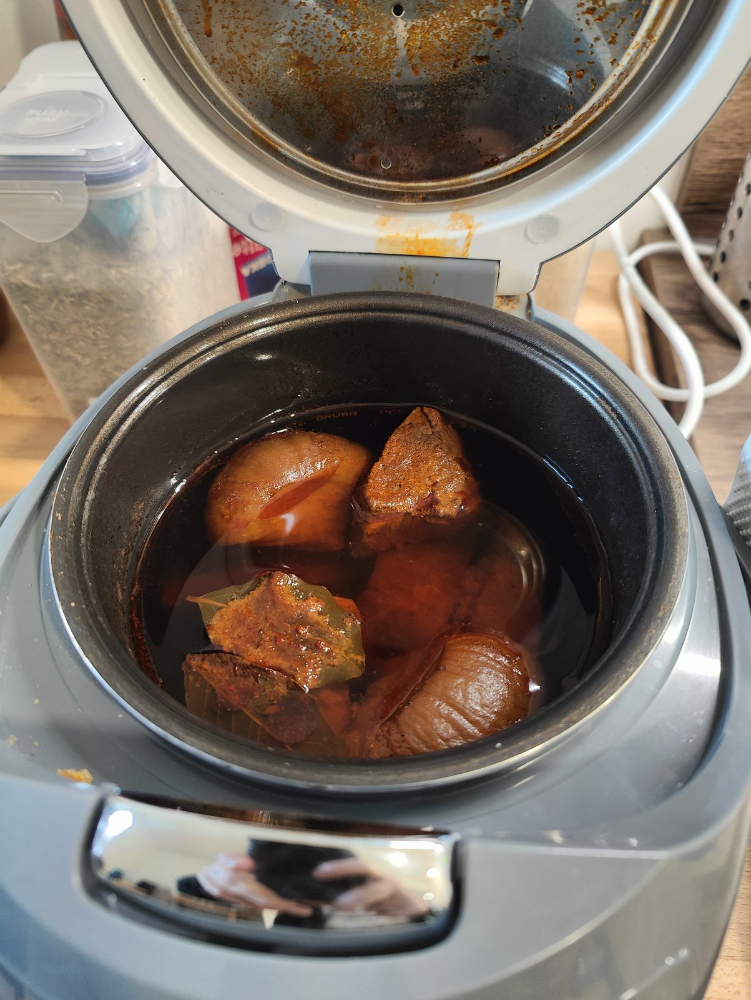
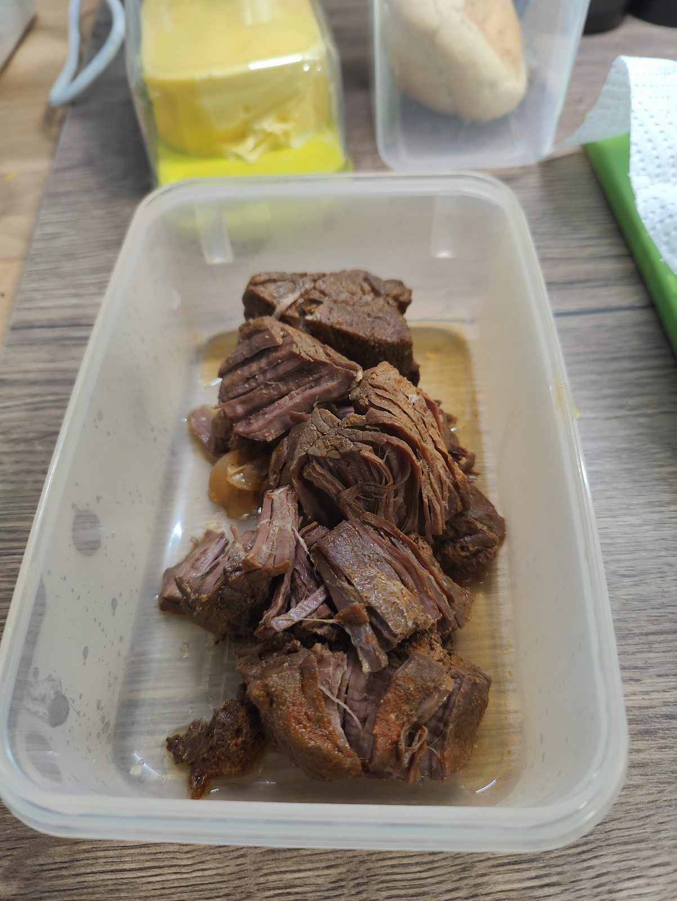
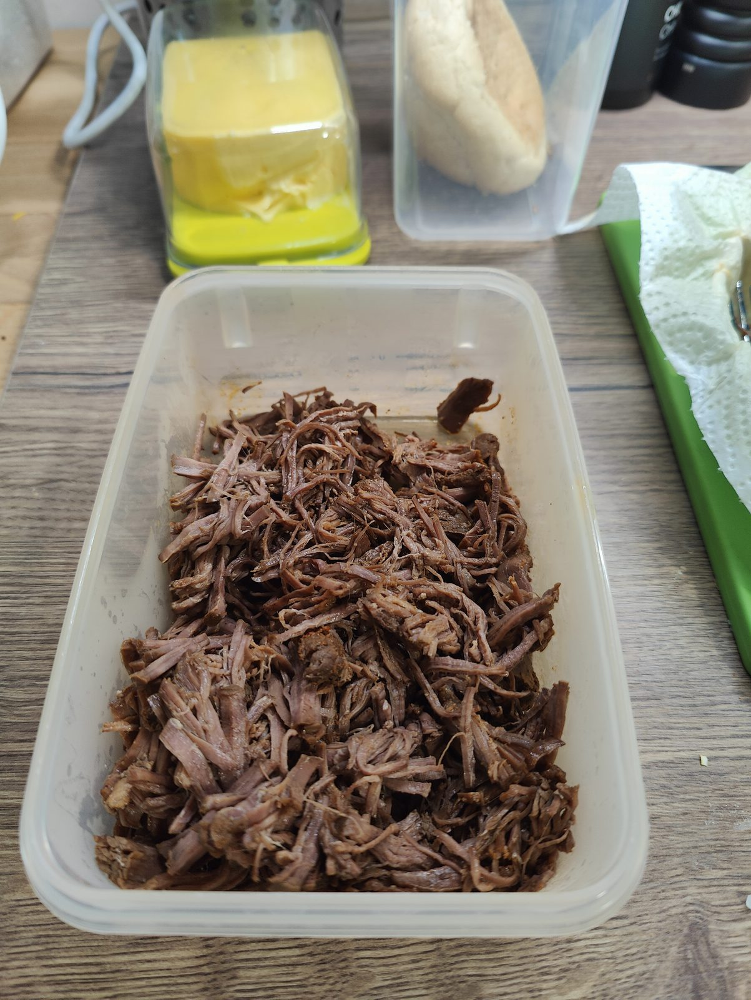

# Stand dieser Notiz

Die zugrunde liegende Notiz enthält **keinen Text, nur drei Fotos**. Was hier steht, ist aus den Fotos gelesen, nicht aus einer geschriebenen Anleitung. Die Mengen, Zeiten und die genaue Würzung sind daher nicht überliefert und unten als offene Punkte benannt. Das Konzept trägt deshalb `status: draft`.

# Was auf den Fotos zu sehen ist

## 1. Im Schongarer

Vier bis fünf faustgroße Stücke [Rindfleisch](/zutaten/fleisch/rindfleisch-schmorstueck.md) liegen in einem elektrischen Schongarer (Multikocher, Programm "Brown/Poêler" am Topfrand ablesbar). Sie sind außen deutlich braun, also **vor dem Schmoren [angebraten](/techniken/anbraten.md)**. Die Flüssigkeit steht etwa zur Hälfte am Fleisch, ist dunkelbraun und mit einer roten, öligen Schicht bedeckt, was auf [Paprikapulver](/zutaten/gewuerze/paprikapulver.md) in einer Trockenwürzung hindeutet. Zwei [Lorbeerblätter](/zutaten/gewuerze/lorbeerblatt.md) schwimmen obenauf, dazu eine mitgeschmorte [Zwiebel](/zutaten/gemuese/zwiebel.md).

## 2. Nach dem Schmoren

Das Fleisch liegt in einer Vorratsdose, in grobe Stücke geteilt. Die Fasern sind bereits sichtbar getrennt, das Fleisch ist bis in die Mitte durchgezogen. Daneben stehen Butter und ein [Sauerteigbrötchen](/gerichte/broetchen.md) bereit.

## 3. Gezupft

Das fertige Ergebnis: vollständig [gezupftes Fleisch](/techniken/fleisch-zupfen.md) in einer dünnen Schicht Schmorfond, feucht, aber nicht in Flüssigkeit schwimmend.

# Abgeleiteter Ablauf

1. **Trocken würzen.** Das Fleisch großzügig mit [Salz](/zutaten/gewuerze/salz.md), [Paprikapulver](/zutaten/gewuerze/paprikapulver.md) und [schwarzem Pfeffer](/zutaten/gewuerze/schwarzer-pfeffer.md) einreiben. Die rote Fettschicht auf dem ersten Foto kommt von dieser Würzung.
2. **Anbraten.** Rundum scharf [anbraten](/techniken/anbraten.md), bis eine durchgehende braune Kruste steht.
3. **Schmoren.** Mit Zwiebel und Lorbeerblatt in den Schongarer geben, so viel Flüssigkeit angießen, dass das Fleisch etwa zur Hälfte steht, und mehrere Stunden [schmoren](/techniken/schmoren.md), bis es auf Druck nachgibt.
4. **Ruhen.** Herausnehmen und kurz ruhen lassen, bevor es zerteilt wird.
5. **Zupfen.** Mit zwei Gabeln [in Fasern zupfen](/techniken/fleisch-zupfen.md) und mit etwas Schmorfond mischen, damit es nicht austrocknet.

# Was die Notiz offen lässt

- [ ] Welches Teilstück (Schulter, Nacken, Brust) und wieviel Gewicht
- [ ] Die genaue Würzmischung des Rubs
- [ ] Die Schmorflüssigkeit (Brühe, Bier, Tomate) und ihre Menge
- [ ] Temperatur und Dauer des Schongarers
- [ ] Ob eine Sauce aus dem Fond gemacht wurde

Wer das Gericht das nächste Mal kocht, sollte diese fünf Punkte notieren; dann wird aus dem Entwurf ein Rezept.

# Verwandtes

Die Küche dahinter: [US-amerikanische Küche](/kuechen/us-amerikanisch.md). Serviert wurde es ausweislich der Fotos mit [Sauerteigbrötchen](/gerichte/broetchen.md). Die Techniken: [Schmoren](/techniken/schmoren.md) und [Fleisch zupfen](/techniken/fleisch-zupfen.md).
