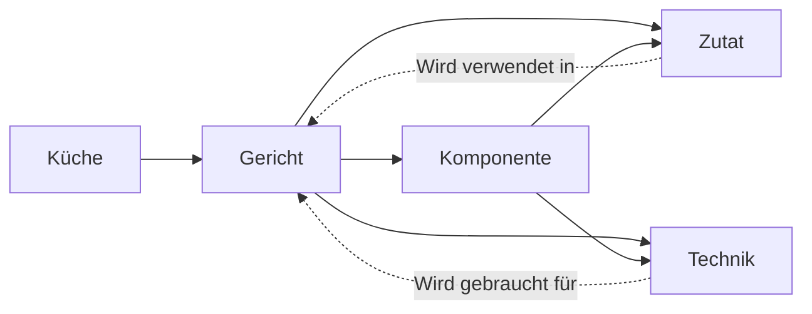

# Was dieses Bundle ist

Eine Rezeptsammlung, die nicht bei „Rezept" aufhört. Jede Zutat und jede Zubereitungstechnik ist ein eigenes Konzept mit eigener Datei. Ein Gericht ist damit kein Textblock, sondern ein Knoten in einem Graph: es verweist auf seine Zutaten und auf die Techniken, die es verlangt, und jede Zutat verweist zurück auf die Gerichte, in denen sie vorkommt.

Genau diese Rückverweise sind der Zweck. Wer eine Zwiebel, eine Karotte und eine Kartoffel im Haus hat, liest die drei Zutatenkonzepte und schneidet ihre Abschnitte „Wird verwendet in" gegeneinander. Was übrig bleibt, ist kochbar. Die Methode steht in [Rückwärtssuche](/guide/rueckwaertssuche.md).

# Die vier Ebenen

| Ebene | Typ | Was darin steht | Beispiel |
|-------|-----|-----------------|----------|
| Gericht | `Rezept` | Das fertige Essen: Zutatenliste mit Mengen, Ablauf, Varianten | [Japanisches Curry](/gerichte/japanisches-curry.md) |
| Komponente | `Rezeptkomponente` | Ein Baustein, den mehrere Gerichte teilen | [Curry-Roux](/komponenten/curry-roux.md), [Japanischer Reis](/komponenten/japanischer-reis.md) |
| Zutat | `Zutat` | Ein einzelnes Lebensmittel: Sorten, Einkauf, Lagerung, Ersatz, Verwendung | [Zwiebel](/zutaten/gemuese/zwiebel.md), [Currypulver](/zutaten/gewuerze/currypulver.md) |
| Technik | `Zubereitungstechnik` | Ein Handgriff oder eine Garmethode, unabhängig vom Rezept | [Anschwitzen](/techniken/anschwitzen.md), [Mehlschwitze](/techniken/mehlschwitze.md) |

Eine fünfte, querliegende Ebene sind die Küchen: [Japanische Küche](/kuechen/japanisch.md) bündelt, welche Zutaten und Techniken eine Landesküche prägen.

# Wie die Kanten laufen

Die durchgezogenen Kanten schreibt das Rezept, die gestrichelten schreiben Zutat und Technik zurück. Beide Richtungen werden von Hand gepflegt: wer ein Gericht anlegt, ergänzt in jeder verwendeten Zutat eine Zeile unter „Wird verwendet in". Ohne diesen zweiten Schritt funktioniert die Rückwärtssuche nicht.

# Was drin ist

- **Gerichte.** [Japanisches Curry](/gerichte/japanisches-curry.md), das erste vollständig ausgearbeitete Rezept.
- **Komponenten.** [Curry-Roux](/komponenten/curry-roux.md) (selbst gemacht statt Fertigblock) und [Japanischer Reis](/komponenten/japanischer-reis.md).
- **Zutaten.** Zwanzig Konzepte in sechs Warengruppen, von der [Zwiebel](/zutaten/gemuese/zwiebel.md) über [Hähnchenschenkel](/zutaten/fleisch/haehnchenschenkel.md) bis zur [Worcestershiresauce](/zutaten/wuerzmittel/worcestershiresauce.md).
- **Techniken.** Neun Handgriffe vom [Würfeln](/techniken/wuerfeln.md) über [Rangiri](/techniken/rangiri.md) und [Anschwitzen](/techniken/anschwitzen.md) bis zur [Absorptionsmethode](/techniken/reis-kochen-absorptionsmethode.md) für Reis.

# Wie es wächst

Die Konventionen, die das Bundle zusammenhalten (Frontmatter je Typ, Pflichtabschnitte, die Rückverweis-Regel), stehen in [Arbeiten in diesem Bundle](/guide/arbeiten-in-diesem-bundle.md). Neue Gerichte bringen neue Zutaten mit, aber die alten werden wiederverwendet: eine Zutat existiert genau einmal, egal in wie vielen Gerichten sie steckt.
