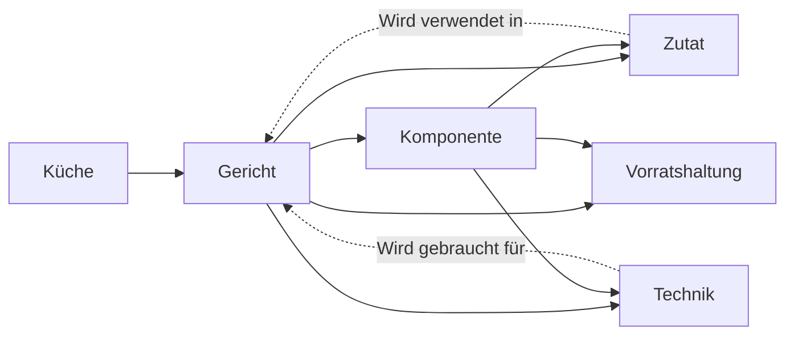

# Was dieses Bundle ist

Eine Rezeptsammlung, die nicht bei „Rezept" aufhört. Jede Zutat und jede Zubereitungstechnik ist ein eigenes Konzept mit eigener Datei. Ein Gericht ist damit kein Textblock, sondern ein Knoten in einem Graph: es verweist auf seine Zutaten und auf die Techniken, die es verlangt, und jede Zutat verweist zurück auf die Gerichte, in denen sie vorkommt.

Genau diese Rückverweise sind der Zweck. Wer eine Zwiebel, eine Karotte und eine Kartoffel im Haus hat, liest die drei Zutatenkonzepte und schneidet ihre Abschnitte „Wird verwendet in" gegeneinander. Was übrig bleibt, ist kochbar. Die Methode steht in [Rückwärtssuche](/guide/rueckwaertssuche.md).

# Die vier Ebenen

| Ebene | Typ | Was darin steht | Beispiel |
|-------|-----|-----------------|----------|
| Gericht | `Rezept` | Das fertige Essen: Zutatenliste mit Mengen, Ablauf, Varianten | [Japanisches Curry](/gerichte/japanisches-curry.md) |
| Komponente | `Rezeptkomponente` | Ein Baustein, den mehrere Gerichte teilen | [Curry-Roux](/komponenten/curry-roux.md), [Japanischer Reis](/komponenten/japanischer-reis.md) |
| Zutat | `Zutat` | Ein einzelnes Lebensmittel: Sorten, Einkauf, Lagerung, Ersatz, Verwendung | [Zwiebel](/zutaten/gemuese/zwiebel.md), [Currypulver](/zutaten/gewuerze/currypulver.md) |
| Technik | `Zubereitungstechnik` | Ein Handgriff oder eine Garmethode, unabhängig vom Rezept | [Anschwitzen](/techniken/anschwitzen.md), [Mehlschwitze](/techniken/mehlschwitze.md) |

Eine fünfte, querliegende Ebene sind die Küchen: [Japanische](/kuechen/japanisch.md), [Chinesische](/kuechen/chinesisch.md), [Indische](/kuechen/indisch.md), [Spanische](/kuechen/spanisch.md), [Levantinische](/kuechen/levantinisch.md), [Mexikanische](/kuechen/mexikanisch.md) und [US-amerikanische Küche](/kuechen/us-amerikanisch.md) bündeln jeweils, welche Zutaten, Würzen und Techniken eine Landesküche prägen und welche Gerichte daraus stammen.

Eine sechste, ebenfalls querliegende Ebene ist die [Vorratshaltung](/guide/vorratshaltung.md). Ein Rezept endet in diesem Bundle nicht auf dem Teller, sondern im Kühlschrank: die meisten Gerichte sind für vier Portionen gerechnet, und was mit den übrigen passiert, ist eine eigene Frage mit eigenen Regeln. Jedes Gericht und jede Komponente trägt deshalb einen Abschnitt „Aufbewahren" und im Frontmatter ein Feld `aufbewahrung`, das Eignung, Kühlschrank- und Gefrierzeit maschinenlesbar festhält. Die vier Handgriffe dahinter sind eigene Techniken: [Abkühlen](/techniken/abkuehlen.md), [Portionieren](/techniken/portionieren.md), [Einfrieren](/techniken/einfrieren.md), [Auftauen und Aufwärmen](/techniken/auftauen-und-aufwaermen.md).

# Wie die Kanten laufen

Die durchgezogenen Kanten schreibt das Rezept, die gestrichelten schreiben Zutat und Technik zurück. Beide Richtungen werden von Hand gepflegt: wer ein Gericht anlegt, ergänzt in jeder verwendeten Zutat eine Zeile unter „Wird verwendet in". Ohne diesen zweiten Schritt funktioniert die Rückwärtssuche nicht.

# Was drin ist

- **Gerichte.** Fünfzehn, aus sechs Küchen. Die beiden Currys ([japanisch](/gerichte/japanisches-curry.md) und [indisch](/gerichte/chicken-curry-indisch.md)) liegen als Gegenentwürfe nebeneinander, dazu Pfannengerichte ([Bratreis](/gerichte/bratreis-mit-ei-und-gemuese.md), [Tofu mit Brokkoli](/gerichte/tofu-brokkoli.md), [Scampi-Nudeln](/gerichte/scampi-erdnussbutter-nudeln.md)), Reisgerichte ([Paella](/gerichte/paella.md), [Onigiri](/gerichte/onigiri.md)), Handarbeit ([Jiaozi](/gerichte/jiaozi.md), [Sauerteigbrötchen](/gerichte/broetchen.md)), Vorratsgerichte ([Freezer-Burritos](/gerichte/burrito.md), [Pulled Beef](/gerichte/pulled-beef.md)) ein Dessert ([Brownies](/gerichte/brownies.md)) und Partyfingerfood ([Pizzaschnecken](/gerichte/pizzaschnecken.md)).
- **Komponenten.** Fünf Bausteine, die mehrfach vorkommen oder getrennt verwendbar sind: [Curry-Roux](/komponenten/curry-roux.md), [Japanischer Reis](/komponenten/japanischer-reis.md), [Sushi-Reis](/komponenten/sushi-reis.md), [Jiaozi-Teig](/komponenten/jiaozi-teig.md) und [Jiaozi-Füllung](/komponenten/jiaozi-fuellung.md).
- **Zutaten.** Über 80 Konzepte in neun Warengruppen, von der [Zwiebel](/zutaten/gemuese/zwiebel.md) über [Bomba-Reis](/zutaten/grundzutaten/bomba-reis.md) und [Safran](/zutaten/gewuerze/safran.md) bis zum [Kakaopulver](/zutaten/suesswaren/kakaopulver.md).
- **Techniken.** 30 Handgriffe vom [Würfeln](/techniken/wuerfeln.md) über [Wok-Braten](/techniken/wok-braten.md), [Trockensalzen](/techniken/trockensalzen.md) und [Schmoren](/techniken/schmoren.md) bis zum [Socarrat](/techniken/socarrat.md), darunter vier zur Vorratshaltung, die erst nach dem Kochen einsetzen.

# Herkunft und Bilder

Der größte Teil der Gerichte stammt aus persönlichen Kochnotizen, die in ihrem `sources`-Eintrag mit `author: human:sascha` ausgewiesen sind. Wo eine Notiz nur eine Zutatenliste oder einen Videolink enthielt, ist sie aus der genannten Quelle aufgefüllt worden, und das Konzept sagt an der Stelle, was aus der Notiz stammt und was ergänzt wurde. Wo gar keine Anleitung vorlag, wie beim [Pulled Beef](/gerichte/pulled-beef.md), trägt das Konzept `status: draft` und benennt die offenen Punkte.

Die Fotos liegen unter `assets/` im Bundle, verkleinert auf Kantenlängen um 1600 Pixel, und sind aus den Konzepten heraus eingebunden. Sie sind Prozessdokumentation, kein Schmuck: beim Pulled Beef ersetzen sie die fehlende Anleitung, beim [Brötchen](/gerichte/broetchen.md) trägt eines von ihnen die eigentliche Formel.

# Wie es wächst

Die Konventionen, die das Bundle zusammenhalten (Frontmatter je Typ, Pflichtabschnitte, die Rückverweis-Regel), stehen in [Arbeiten in diesem Bundle](/guide/arbeiten-in-diesem-bundle.md). Neue Gerichte bringen neue Zutaten mit, aber die alten werden wiederverwendet: eine Zutat existiert genau einmal, egal in wie vielen Gerichten sie steckt.
